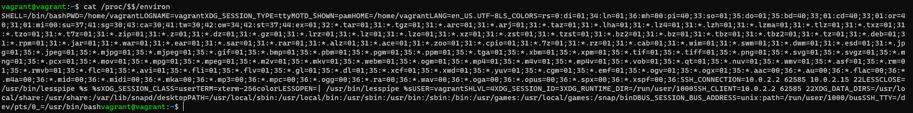

# Домашнее задание к занятию "3.2. Работа в терминале, лекция 2"
1. Какого типа команда `cd`? Попробуйте объяснить, почему она именно такого типа; опишите ход своих мыслей, если считаете что она могла бы быть другого типа.
   1. *Команда cd - это команда встроенная в обоasdлочку. Она встроеная потому что выполняется в текущей сессии без запуска дополнительной оболочки*
   2. *Если бы она была бы не встроенной тогда, после ее завершения нужно было бы завершить оболочку ее выполнения* <br> Для определеня типа команды воспользовался вот такой конструкцией `type -a cd uname : ls uname`
2. Какая альтернатива без pipe команде `grep <some_string> <some_file> | wc -l`? `man grep` поможет в ответе на этот вопрос. Ознакомьтесь с [документом](http://www.smallo.ruhr.de/award.html) о других подобных некорректных вариантах использования pipe.

   

   У команды `grep` есть опция `-c` которая показывает кол-во значений

1. Какой процесс с PID `1` является родителем для всех процессов в вашей виртуальной машине Ubuntu 20.04?

*Как видим процесс с PID `1` - systemd*
4. Как будет выглядеть команда, которая перенаправит вывод stderr `ls` на другую сессию терминала?</br>*Команда перенаправления ошибки в другой терминал`ls /root 2>/dev/pts/2`*
</br> *Результат на прикрепленном скриншоте*

5. Получится ли одновременно передать команде файл на stdin и вывести ее stdout в другой файл? Приведите работающий пример.

   
6. Получится ли находясь в графическом режиме, вывести данные из PTY в какой-либо из эмуляторов TTY? Сможете ли вы наблюдать выводимые данные?
</br> *Получиться. Чтобы увидеть результат требуется выполнить переключение в нужный tty* 
7. Выполните команду `bash 5>&1`. К чему она приведет? Что будет, если вы выполните `echo netology > /proc/$$/fd/5`? Почему так происходит?
* *Команда `bash 5>&1` создает дескриптор 5 и перенаправит его в stdout*
* *Команда `echo netology > /proc/$$/fd/5` выведет строку `netology`. Происходит это, потому что мы запросили вывод дескриптор 5 после выполнения ввода.
Если выполнить эту команду в новой сессии получим ошибку. Т.к. дескриптор не создан для новой сессии.*

8. Получится ли в качестве входного потока для pipe использовать только stderr команды, не потеряв при этом отображение stdout на pty? Напоминаем: по умолчанию через pipe передается только stdout команды слева от | на stdin команды справа. Это можно сделать, поменяв стандартные потоки местами через промежуточный новый дескриптор, который вы научились создавать в предыдущем вопросе.

</br>*`5>&2` - новый дискриптор передали в stderr
</br>`2>&1` - stderr в stdout
</br>`1>&5` - stdout в новый дискриптор*
9. Что выведет команда `cat /proc/$$/environ`? Как еще можно получить аналогичный по содержанию вывод?
* *`cat /proc/$$/environ` - выводит переменные окружения, причем 1 строкой*

* *`env` и `printenv` - вывод у них идентичный с разбиением по группам

10. Используя man, опишите что доступно по адресам /proc/<PID>/cmdline, /proc/<PID>/exe

    */proc/[pid]/cmdline - файл только на чтение, который содержит строку запуска процессов, кроме зомби-процессов \
     /proc/[pid]/exe - ссодержит символическую ссылку указывающую на исполняемый файл процесса загруженный в память ядра*
11. Узнайте, какую наиболее старшую версию набора инструкций SSE поддерживает ваш процессор с помощью /proc/cpuinfo
SSE 4.2

12. При открытии нового окна терминала и `vagrant ssh` создается новая сессия и выделяется pty.  
	Это можно подтвердить командой `tty`, которая упоминалась в лекции 3.2.  
	Однако:

    ```bash
	vagrant@netology1:~$ ssh localhost 'tty'
    not a tty
    ```
    Почитайте, почему так происходит, и как изменить поведение. \
   *Это нормальное поведение, т.к. у запускаемой команды нет выделенного псевдотелетайпа. Такое поведение сделано для корректной работы в скиптах \
   Чтобы исправить ситуацию потребуется или авторизоваться, что приведет к созданию `tty` или выполнить команду `ssh` с опцией `-t`*
    >*-t -- Переназначение псевдо-терминала. Это может быть использовано для произвольного выполнения программ базирующихся на выводе изображения на удаленной машине, что может быть очень полезно, например, при реализации возможностей меню. Несколько параметров -t заданных подряд переназначат терминал, даже если ssh не имеет локального терминала.*

    *цитата взята с  [Opennet.ru](https://www.opennet.ru/cgi-bin/opennet/man.cgi?topic=ssh&category=1)*
13. Бывает, что есть необходимость переместить запущенный процесс из одной сессии в другую. Попробуйте сделать это, воспользовавшись `reptyr`. Например, так можно перенести в `screen` процесс, который вы запустили по ошибке в обычной SSH-сессии. \

*`reptyr <PID>` - возникла ошибка* \

     Unable to attach to pid 1287: Operation not permitted
     The kernel denied permission while attaching. If your uid matches
     the target's, check the value of /proc/sys/kernel/yama/ptrace_scope.
     For more information, see /etc/sysctl.d/10-ptrace.conf
Исправил файл `/etc/sysctl.d/10-ptrace.conf`
     ```
     kernel.yama.ptrace_scope = 0
     ``` \
    Правда использовал `tmux` вместо `screen`, но суть дела не меняет. Все получилось \
    Простая и понятная документация по [reptyr](https://github.com/nelhage/reptyr#ptrace_scope-on-ubuntu-maverick-and-up)

14. `sudo echo string > /root/new_file` не даст выполнить перенаправление в файл под обычным пользователем, так как перенаправлением занимается процесс shell'а, который запущен без `sudo` под вашим пользователем. Для решения данной проблемы можно использовать конструкцию `echo string | sudo tee /root/new_file`. Узнайте? что делает команда `tee` и почему в отличие от `sudo echo` команда с `sudo tee` будет работать.
    *Запись в директорию /root есть только у привилегированного пользователя, а команда перенаправления выполняется без повышения привилегий \
    команда `tee` умеет читать стандартный ввод и производит вывод в cтандартный `stdout` и файл. \
    `echo string | sudo tee /root/new_file` будет работать т.к. запись в файл происходит с повышением привилегий*  
