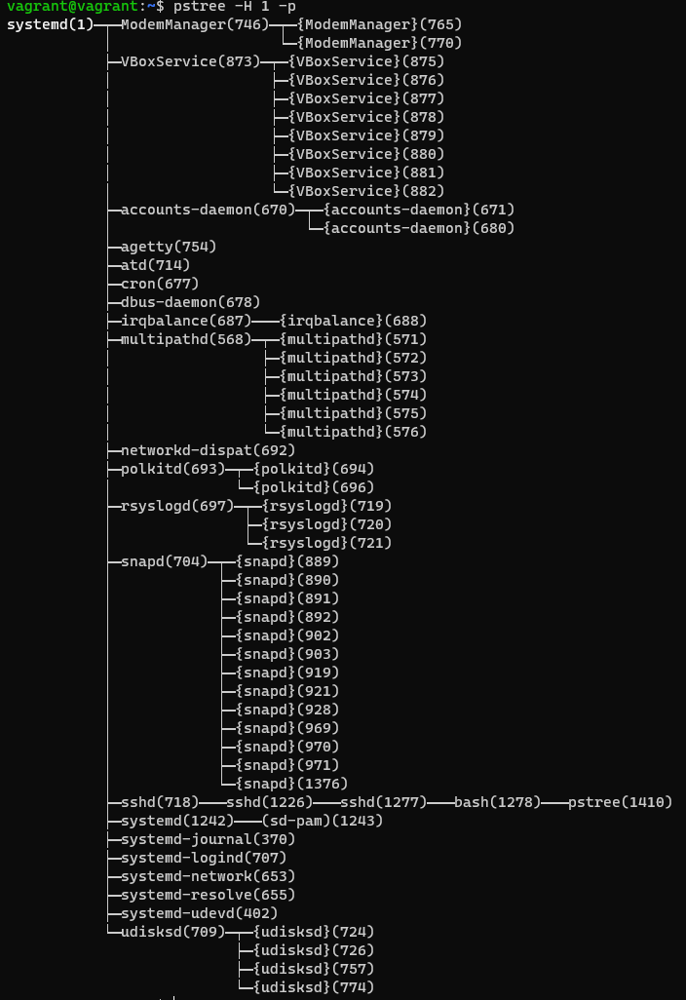

# Домашнее задание к занятию "3.2. Работа в терминале, лекция 2"
1. Какого типа команда `cd`? Попробуйте объяснить, почему она именно такого типа; опишите ход своих мыслей, если считаете что она могла бы быть другого типа.
   1. *Команда cd - это команда встроенная в обоasdлочку. Она встроеная потому что выполняется в текущей сессии без запуска дополнительной оболочки*
   2. *Если бы она была бы не встроенной тогда, после ее завершения нужно было бы завершить оболочку ее выполнения*   Для определеня типа команды воспользовался вот такой конструкцией `type -a cd uname : ls uname`
2. Какая альтернатива без pipe команде `grep <some_string> <some_file> | wc -l`? `man grep` поможет в ответе на этот вопрос. Ознакомьтесь с [документом](http://www.smallo.ruhr.de/award.html) о других подобных некорректных вариантах использования pipe.

   

   У команды `grep` есть опция `-c` которая показывает кол-во значений

1. Какой процесс с PID `1` является родителем для всех процессов в вашей виртуальной машине Ubuntu 20.04?

*Как видим процесс с PID `1` - systemd*
4. Как будет выглядеть команда, которая перенаправит вывод stderr `ls` на другую сессию терминала? *Команда перенаправления ошибки в другой терминал`ls /root 2>/dev/pts/2`*
  Результат на прикрепленном скриншоте

5. Получится ли одновременно передать команде файл на stdin и вывести ее stdout в другой файл? Приведите работающий пример.

   
6. Получится ли находясь в графическом режиме, вывести данные из PTY в какой-либо из эмуляторов TTY? Сможете ли вы наблюдать выводимые данные?

8. Выполните команду `bash 5>&1`. К чему она приведет? Что будет, если вы выполните `echo netology > /proc/$$/fd/5`? Почему так происходит?
