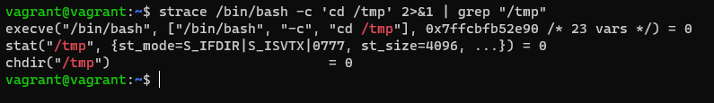
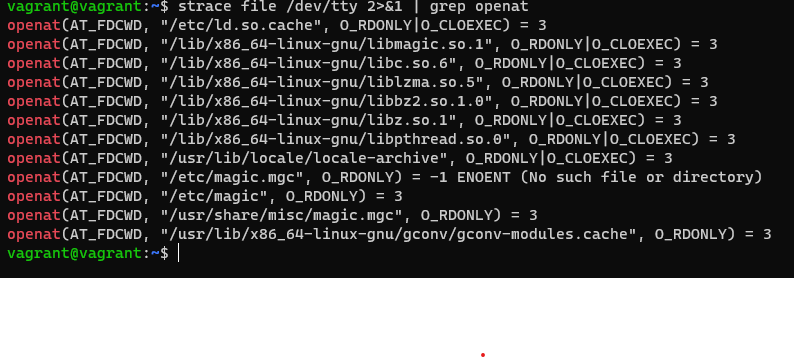
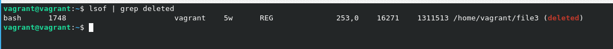
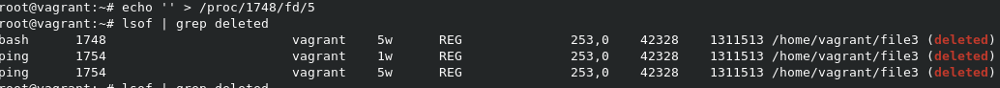
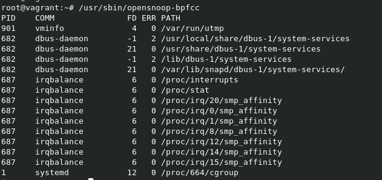
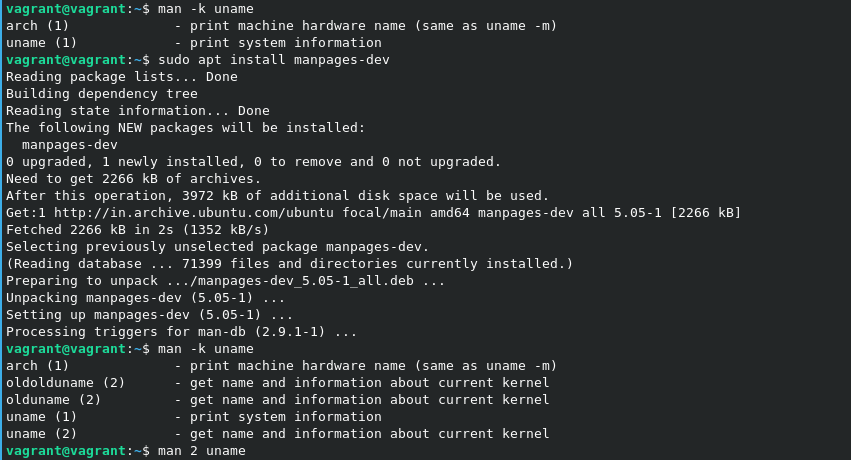

# Домашнее задание к занятию "3.3. Операционные системы. Лекция 1"

### Цель задания

В результате выполнения этого задания вы:

1. Познакомитесь с инструментом strace, который помогает отслеживать системные вызовы процессов, и является необходимым для отладки и расследований в случае возникновения ошибок в работе программ.
2. Рассмотрите различные режимы работы скриптов, настраиваемые командой set. Один и тот же код в скриптах в разных режимах работы ведет себя по-разному.

### Чек лист готовности к домашнему заданию

1. Убедитесь, что у вас установлен инструмент `strace`, выполнив команду `strace -V` для проверки версии. В Ubuntu 20.04 strace установлен, но в других дистрибутивах его может не быть "из коробки". Обратитесь к документации дистрибутива, как установить инструмент strace.
2. Убедитесь, что у вас установлен пакет `bpfcc-tools`, [сведения по установке](https://github.com/iovisor/bcc/blob/master/INSTALL.md)

### Инструменты/ дополнительные материалы, которые пригодятся для выполнения задания

1. Изучите документацию lsof - `man lsof` или та же информация, но в [сети](https://linux.die.net/man/8/lsof)
2. Документация по режимам работы bash находится в `help set` или в [сети](https://www.gnu.org/software/bash/manual/html_node/The-Set-Builtin.html)

------

## Задание

1. Какой системный вызов делает команда `cd`? 

    В прошлом ДЗ мы выяснили, что `cd` не является самостоятельной программой, это `shell builtin`, поэтому запустить `strace` непосредственно на `cd` не получится. Тем не менее вы можете запустить `strace` на `/bin/bash -c 'cd /tmp'`. В этом случае вы увидите полный список системных вызовов, которые делает сам `bash` при старте. 

    Вам нужно найти тот единственный, который относится именно к `cd`. Обратите внимание, что `strace` выдаёт результат своей работы в поток stderr, а не в stdout.
   * *системный вызов `chdir()`. В нашем случае `chdir("/tmp")`* 
   

2. Попробуйте использовать команду `file` на объекты разных типов в файловой системе. Например:
    ```bash
    vagrant@netology1:~$ file /dev/tty
    /dev/tty: character special (5/0)
    vagrant@netology1:~$ file /dev/sda
    /dev/sda: block special (8/0)
    vagrant@netology1:~$ file /bin/bash
    /bin/bash: ELF 64-bit LSB shared object, x86-64
    ```
    Используя `strace` выясните, где находится база данных `file`, на основании которой она делает свои догадки.
    * *Вызывается файл `/usr/share/misc/magic.mgc`.*
   

3. Предположим, приложение пишет лог в текстовый файл. Этот файл оказался удален (deleted в lsof), однако возможности сигналом сказать приложению переоткрыть файлы или просто перезапустить приложение – нет. Так как приложение продолжает писать в удаленный файл, место на диске постепенно заканчивается. Основываясь на знаниях о перенаправлении потоков предложите способ обнуления открытого удаленного файла (чтобы освободить место на файловой системе).
* *Например, в ``screen`` или в `tmux` создали файловый дескриптор 5 и вывели его в file3 `bash 5>file3` </br>
    выполним команду `ping localhost>&5`, </br>
    выйдем из эмулятора терминала и удалим файл `file3`</br> 
    командой `lsof | grep delete` найдем нужные нам процессы.
    
    Далее отправляем команду `echo > /proc/1748/fd/5`
    
Или если процесс не особо нужный `kill -9 1748`*
4. Занимают ли зомби-процессы какие-то ресурсы в ОС (CPU, RAM, IO)?
* *Нет, процессы "зомби" не занимают ресурсы в ОС. Но занимают место в таблице процессов.*

5. В iovisor BCC есть утилита `opensnoop`:
    ```bash
    root@vagrant:~# dpkg -L bpfcc-tools | grep sbin/opensnoop
    /usr/sbin/opensnoop-bpfcc
    ```
    На какие файлы вы увидели вызовы группы `open` за первую секунду работы утилиты? Воспользуйтесь пакетом `bpfcc-tools` для Ubuntu 20.04. Дополнительные [сведения по установке](https://github.com/iovisor/bcc/blob/master/INSTALL.md).
  
</br>*Перед выполнением перешел под `root`*
2. Какой системный вызов использует `uname -a`? Приведите цитату из man по этому системному вызову, где описывается альтернативное местоположение в `/proc`, где можно узнать версию ядра и релиз ОС.
* *В доступном `man` этой инф-ии нет. Нужно ставить  `manpages-dev` </br> На 50 Строке*
  >Part of the utsname information is also accessible via /proc/sys/kernel/{ostype, hostname, osrelease, version, domainname}.
  > 
  
7. Чем отличается последовательность команд через `;` и через `&&` в bash? Например:
    ```bash
    root@netology1:~# test -d /tmp/some_dir; echo Hi
    Hi
    root@netology1:~# test -d /tmp/some_dir && echo Hi
    root@netology1:~#
    ```
    Есть ли смысл использовать в bash `&&`, если применить `set -e`?
    * *`&&` - управляющий оператор. Выполнение второй команды произойдет только в том случае, если выполнение первой команды вернуло статус `0`*
    * *`;` - Оператор последовательного выполнения команд.* 
    * *`set -e` - устанавливает значения командной оболочки*
    * *Смысл использовать `set -e` совместно с `&&`, предполагаю есть. Это позволит выполнить скрипт, даже в том случае, если команды завершатся ошибками.*

2. Из каких опций состоит режим bash `set -euxo pipefail` и почему его хорошо было бы использовать в сценариях? </br>
   `-e` - завершает сессию при `0` </br>
   `-u` - обрабатывает неустановленные или неопределенные переменные, за исключением специальных параметров, таких как подстановочные знаки (*) или «@», как ошибки во время раскрытия параметра. </br>
   `-x` - печатает аргументы команды во время выполнения </br>
   `-o pipfail` - статус выхода из конвейера является значением последней (самой правой) команды, завершённой с ненулевым статусом, или ноль — если работа всех команд завершена успешно.
   * Завершит сценарий на любом этапе выполнения, плюс логирование выполнения сценария*
3. Используя `-o stat` для `ps`, определите, какой наиболее часто встречающийся статус у процессов в системе. В `man ps` ознакомьтесь (`/PROCESS STATE CODES`) что значат дополнительные к основной заглавной буквы статуса процессов. Его можно не учитывать при расчете (считать S, Ss или Ssl равнозначными).

 