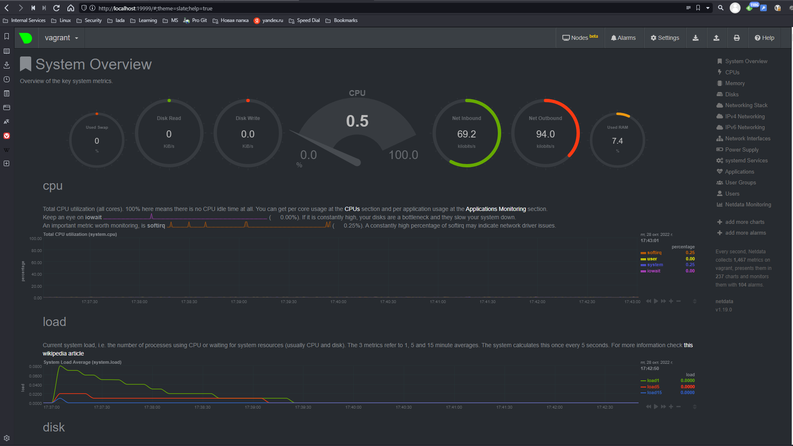
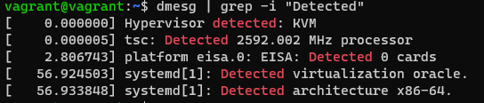
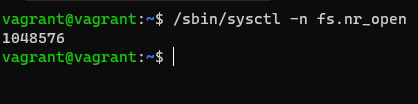
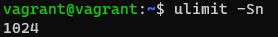
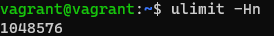
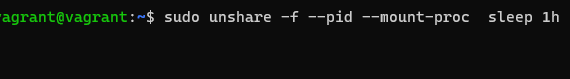
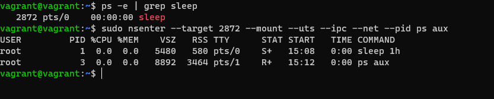
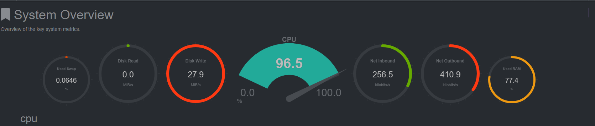
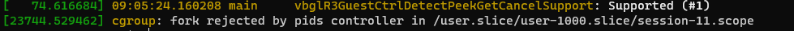
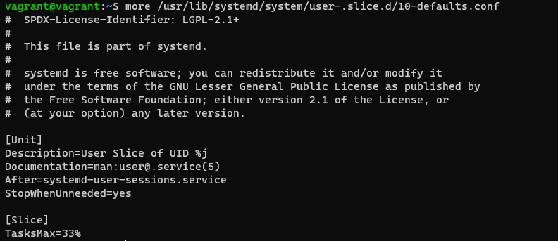

# Домашнее задание к занятию "3.4. Операционные системы. Лекция 2"

### Цель задания

В результате выполнения этого задания вы:
1. Ознакомитесь со средством сбора метрик node_exporter и средством сбора и визуализации метрик NetData. Такого рода инструменты позволяют выстроить систему мониторинга сервисов для своевременного выявления проблем в их работе.
2. Построите простой systemd unit файл для создания долгоживущих процессов, которые стартуют вместе со стартом системы автоматически.
3. Проанализируете dmesg, а именно часть лога старта виртуальной машины, чтобы понять, какая полезная информация может там находиться.
4. Поработаете с unshare и nsenter для понимания, как создать отдельный namespace для процесса (частичная контейнеризация).

### Чеклист готовности к домашнему заданию

1. Убедитесь, что у вас установлен [Netdata](https://github.com/netdata/netdata) c ресурса с предподготовленными [пакетами](https://packagecloud.io/netdata/netdata/install) или `sudo apt install -y netdata`.


### Инструкция к заданию

1. Создайте .md-файл для ответов на задания в своём репозитории, после выполнения прикрепите ссылку на него в личном кабинете.
2. Любые вопросы по решению задач задавайте в чате учебной группы.


### Инструменты/ дополнительные материалы, которые пригодятся для выполнения задания

1. [Документация](https://www.freedesktop.org/software/systemd/man/systemd.service.html) по systemd unit файлам
2. [Документация](https://www.kernel.org/doc/Documentation/sysctl/) по параметрам sysctl

------

## Задание

1. На лекции мы познакомились с [node_exporter](https://github.com/prometheus/node_exporter/releases). В демонстрации его исполняемый файл запускался в background. Этого достаточно для демо, но не для настоящей production-системы, где процессы должны находиться под внешним управлением. Используя знания из лекции по systemd, создайте самостоятельно простой [unit-файл](https://www.freedesktop.org/software/systemd/man/systemd.service.html) для node_exporter:
    ```bash
    $ sudo mkdir /opt/node_exoprter
    $ sudo wget https://github.com/prometheus/node_exporter/releases/download/v1.4.0/node_exporter-1.4.0.linux-amd64.tar.gz
    $ sudo tar xvf node_exporter-1.4.0.linux-amd64.tar.gz
    $ cd /opt/node_exporter
    $ sudo cp node_exporter-1.4.0.linux-amd64/* ./
    $ rm -r node_exporter-1.4.0.linux-amd64/
   ```
    * поместите его в автозагрузку,
    ```bash
    $ sudo touch /etc/default/node_exporter
    $ sudo systemctl edit --full --force node_exporter.service
    ```
    ```bash
    [Unit]
    Description=Prometheus Node Exporter
    Wants=network-online.target
    After=network-online.target
    [Service]
    Type=simple
    ExecStart=/opt/node_exporter/node_exporter
    EnvironmentFile=/etc/default/node_exporter
    [Install]
    WantedBy=multi-user.target
    ```
    ```bash
    $ sudo systemctl enable node_exporter
    $ sudo systemctl start node_exporter
    ```
    * предусмотрите возможность добавления опций к запускаемому процессу через внешний файл (посмотрите, например, на `systemctl cat cron`),
    </br>*`EnvironmentFile=/etc/default/node_exporter` добавлена строка в unit-файл*
    * удостоверьтесь, что с помощью systemctl процесс корректно стартует, завершается, а после перезагрузки автоматически поднимается.
    </br>*стартует, перезапускается, останавливается и автоматически стартует после перезагрузки*

1. Ознакомьтесь с опциями node_exporter и выводом `/metrics` по-умолчанию. Приведите несколько опций, которые вы бы выбрали для базового мониторинга хоста по CPU, памяти, диску и сети.</br>
   CPU
   ```bash
   node_cpu_seconds_total{cpu="0",mode="idle"}
   node_cpu_seconds_total{cpu="0",mode="system"}
   node_cpu_seconds_total{cpu="0",mode="user"}
   process_cpu_seconds_total
   ```
   Память
   ```bash
   node_memory_MemAvailable_bytes
   node_memory_MemFree_bytes
   node_memory_Buffers_bytes
   node_memory_Cached_bytes
   ```
   Диск
   ```bash
   node_disk_io_time_seconds_total{device="sda"}
   node_disk_read_time_seconds_total{device="sda"}
   node_disk_write_time_seconds_total{device="sda"}
   node_filesystem_avail_bytes
   ```
   Сеть
   ```bash
   node_network_info
   node_network_receive_bytes_total
   node_network_receive_errs_total
   node_network_transmit_bytes_total
   node_network_transmit_errs_total
   ```
1. Установите в свою виртуальную машину [Netdata](https://github.com/netdata/netdata). Воспользуйтесь [готовыми пакетами](https://packagecloud.io/netdata/netdata/install) для установки (`sudo apt install -y netdata`). 
   
   После успешной установки:
    * в конфигурационном файле `/etc/netdata/netdata.conf` в секции [web] замените значение с localhost на `bind to = 0.0.0.0`,
    * добавьте в Vagrantfile проброс порта Netdata на свой локальный компьютер и сделайте `vagrant reload`:

    ```bash
    config.vm.network "forwarded_port", guest: 19999, host: 19999
    ```

    После успешной перезагрузки в браузере *на своем ПК* (не в виртуальной машине) вы должны суметь зайти на `localhost:19999`. Ознакомьтесь с метриками, которые по умолчанию собираются Netdata и с комментариями, которые даны к этим метрикам.

1. Можно ли по выводу `dmesg` понять, осознает ли ОС, что загружена не на настоящем оборудовании, а на системе виртуализации?</br>
   
</br> *Можно по параметрам `Hypervisor detected: KVM` и `systemd[1]: Detected virtualization oracle`. Это в нашем случае*

1. Как настроен sysctl `fs.nr_open` на системе по-умолчанию? Определите, что означает этот параметр. Какой другой существующий лимит не позволит достичь такого числа (`ulimit --help`)?
   1. *`/sbin/sysctl -n fs.nr_open` - текущее значение (max количество файловых дескрипторов для ядра)*
   
   2. *Так же существует мягкий лимит (на пользователя). По умолчанию равен `1024`*
    \
   *его можно и увеличить и уменьшить, но он не может превышать параметр `fs.nr_open`*
   3. *И жесткий лимит* \
    \
   *Он может быть только уменьшен и не может превышать `fs.nr_open`*
1. Запустите любой долгоживущий процесс (не `ls`, который отработает мгновенно, а, например, `sleep 1h`) в отдельном неймспейсе процессов; покажите, что ваш процесс работает под PID 1 через `nsenter`. Для простоты работайте в данном задании под root (`sudo -i`). Под обычным пользователем требуются дополнительные опции (`--map-root-user`) и т.д.
   * 
   * 
1. Найдите информацию о том, что такое `:(){ :|:& };:`. Запустите эту команду в своей виртуальной машине Vagrant с Ubuntu 20.04 (**это важно, поведение в других ОС не проверялось**). Некоторое время все будет "плохо", после чего (минуты) – ОС должна стабилизироваться. Вызов `dmesg` расскажет, какой механизм помог автоматической стабилизации.  
Как настроен этот механизм по-умолчанию, и как изменить число процессов, которое можно создать в сессии?
 \
*Система пошла в Overload. Данная функция вызывает рекурсивно саму себя, так называемая fork bomb*
   1. *вывод dmesg* \
   
   3. *По умолчанию*\
   
   4. *Для изменения числа процессов нужно или в файле `/usr/lib/systemd/system/user-.slice.d/10-defaults.conf` увеличить значение `TaskMax=`, или установить значение `infinity`, или выполнить команду `ulimit -u <число>`* 
   
   
*В качестве решения ответьте на вопросы и опишите каким образом эти ответы были получены*

----

