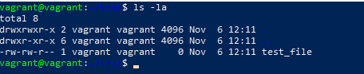
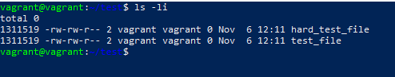
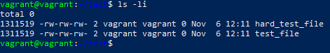
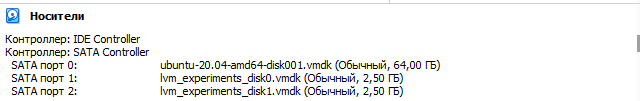
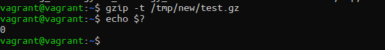
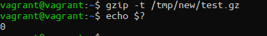

# Домашнее задание к занятию "3.5. Файловые системы"

1. Узнайте о [sparse](https://ru.wikipedia.org/wiki/%D0%A0%D0%B0%D0%B7%D1%80%D0%B5%D0%B6%D1%91%D0%BD%D0%BD%D1%8B%D0%B9_%D1%84%D0%B0%D0%B9%D0%BB) (разряженных) файлах.

1. Могут ли файлы, являющиеся жесткой ссылкой на один объект, иметь разные права доступа и владельца? Почему? \
   *Нет не могут, т.к. "жесткая ссылка" это посути тот же файл (ссылка на область диска). И если ему переназначить права, то права заменятся на целевом файле.*
   * Создали файл test_file `touch test_file`\
   
   * Создали hardlink hard_test_file `ln test_file hard_test_file`
   
   * Заменим права, например добавим "другим" пользователям права записи `chmod o+w hard_test_file`
   \
   Как видим права заменились и у целевого файла, потомучто это ссылка на область диска. И если удалить целевой файл, то данные в него записаные продолжат быть доступыми из жесткой ссылки.  
1. Сделайте `vagrant destroy` на имеющийся инстанс Ubuntu. Замените содержимое Vagrantfile следующим:

    ```bash
    Vagrant.configure("2") do |config|
      config.vm.box = "bento/ubuntu-20.04"
      config.vm.provider :virtualbox do |vb|
        lvm_experiments_disk0_path = "/tmp/lvm_experiments_disk0.vmdk"
        lvm_experiments_disk1_path = "/tmp/lvm_experiments_disk1.vmdk"
        vb.customize ['createmedium', '--filename', lvm_experiments_disk0_path, '--size', 2560]
        vb.customize ['createmedium', '--filename', lvm_experiments_disk1_path, '--size', 2560]
        vb.customize ['storageattach', :id, '--storagectl', 'SATA Controller', '--port', 1, '--device', 0, '--type', 'hdd', '--medium', lvm_experiments_disk0_path]
        vb.customize ['storageattach', :id, '--storagectl', 'SATA Controller', '--port', 2, '--device', 0, '--type', 'hdd', '--medium', lvm_experiments_disk1_path]
      end
    end
    ```

    Данная конфигурация создаст новую виртуальную машину с двумя дополнительными неразмеченными дисками по 2.5 Гб.
    

1. Используя `fdisk`, разбейте первый диск на 2 раздела: 2 Гб, оставшееся пространство.
   ``` bash
   vagrant@vagrant:~$ sudo fdisk /dev/sdb

   Welcome to fdisk (util-linux 2.34).
   Changes will remain in memory only, until you decide to write them.
   Be careful before using the write command.

   Device does not contain a recognized partition table.
   Created a new DOS disklabel with disk identifier 0x99e1563b.

   Command (m for help): F
   Unpartitioned space /dev/sdb: 2.51 GiB, 2683305984 bytes, 5240832 sectors
   Units: sectors of 1 * 512 = 512 bytes
   Sector size (logical/physical): 512 bytes / 512 bytes

   Start     End Sectors  Size
   2048 5242879 5240832  2.5G

   Command (m for help): n
   Partition type
     p   primary (0 primary, 0 extended, 4 free)
     e   extended (container for logical partitions)
   Select (default p): p
   Partition number (1-4, default 1):
   First sector (2048-5242879, default 2048):
   Last sector, +/-sectors or +/-size{K,M,G,T,P} (2048-5242879, default 5242879): +2G

   Created a new partition 1 of type 'Linux' and of size 2 GiB.

   Command (m for help): n
   Partition type
     p   primary (1 primary, 0 extended, 3 free)
     e   extended (container for logical partitions)
   Select (default p):

   Using default response p.
   Partition number (2-4, default 2):
   First sector (4196352-5242879, default 4196352):
   Last sector, +/-sectors or +/-size{K,M,G,T,P} (4196352-5242879, default 5242879):

   Created a new partition 2 of type 'Linux' and of size 511 MiB.

   Command (m for help): w
   The partition table has been altered.
   Calling ioctl() to re-read partition table.
   Syncing disks.

   vagrant@vagrant:~$ lsblk
   NAME                      MAJ:MIN RM  SIZE RO TYPE MOUNTPOINT
   sda                         8:0    0   64G  0 disk
   ├─sda1                      8:1    0    1M  0 part
   ├─sda2                      8:2    0  1.5G  0 part /boot
   └─sda3                      8:3    0 62.5G  0 part
     └─ubuntu--vg-ubuntu--lv 253:0    0 31.3G  0 lvm  /
   sdb                         8:16   0  2.5G  0 disk
   ├─sdb1                      8:17   0    2G  0 part
   └─sdb2                      8:18   0  511M  0 part
   sdc                         8:32   0  2.5G  0 disk
   ```

1. Используя `sfdisk`, перенесите данную таблицу разделов на второй диск.
   ```bash
   vagrant@vagrant:~$ sudo sfdisk -d /dev/sdb < sdb.dump
   vagrant@vagrant:~$ sudo sfdisk /dev/sdc < sdb.dump
   Checking that no-one is using this disk right now ... OK

   Disk /dev/sdc: 2.51 GiB, 2684354560 bytes, 5242880 sectors
   Disk model: VBOX HARDDISK
   Units: sectors of 1 * 512 = 512 bytes
   Sector size (logical/physical): 512 bytes / 512 bytes
   I/O size (minimum/optimal): 512 bytes / 512 bytes

   >>> Script header accepted.
   >>> Script header accepted.
   >>> Script header accepted.
   >>> Script header accepted.
   >>> Created a new DOS disklabel with disk identifier 0xb2fdf29d.
   /dev/sdc1: Created a new partition 1 of type 'Linux' and of size 2 GiB.
   /dev/sdc2: Created a new partition 2 of type 'Linux' and of size 511 MiB.
   /dev/sdc3: Done.

   New situation:
   Disklabel type: dos
   Disk identifier: 0xb2fdf29d

   Device     Boot   Start     End Sectors  Size Id Type
   /dev/sdc1          2048 4196351 4194304    2G 83 Linux
   /dev/sdc2       4196352 5242879 1046528  511M 83 Linux

   The partition table has been altered.
   Calling ioctl() to re-read partition table.
   Syncing disks.
   ```

1. Соберите `mdadm` RAID1 на паре разделов 2 Гб.
   ```bash
   vagrant@vagrant:~$ sudo mdadm --create /dev/md0 --level=1 --raid-devices=2 /dev/sd[bc]1
   mdadm: Note: this array has metadata at the start and
       may not be suitable as a boot device.  If you plan to
       store '/boot' on this device please ensure that
       your boot-loader understands md/v1.x metadata, or use
       --metadata=0.90
   Continue creating array?
   Continue creating array? (y/n)
   Continue creating array? (y/n) y
   mdadm: Defaulting to version 1.2 metadata
   mdadm: array /dev/md0 started.
   vagrant@vagrant:~$ lsblk
   NAME                      MAJ:MIN RM  SIZE RO TYPE  MOUNTPOINT
   loop0                       7:0    0 61.9M  1 loop  /snap/core20/1328
   loop1                       7:1    0 67.2M  1 loop  /snap/lxd/21835
   loop2                       7:2    0 43.6M  1 loop  /snap/snapd/14978
   loop3                       7:3    0   48M  1 loop  /snap/snapd/17336
   loop4                       7:4    0 63.2M  1 loop  /snap/core20/1634
   loop5                       7:5    0 67.8M  1 loop  /snap/lxd/22753
   sda                         8:0    0   64G  0 disk
   ├─sda1                      8:1    0    1M  0 part
   ├─sda2                      8:2    0  1.5G  0 part  /boot
   └─sda3                      8:3    0 62.5G  0 part
     └─ubuntu--vg-ubuntu--lv 253:0    0 31.3G  0 lvm   /
   sdb                         8:16   0  2.5G  0 disk
   ├─sdb1                      8:17   0    2G  0 part
   │ └─md0                     9:0    0    2G  0 raid1
   └─sdb2                      8:18   0  511M  0 part
   sdc                         8:32   0  2.5G  0 disk
   ├─sdc1                      8:33   0    2G  0 part
   │ └─md0                     9:0    0    2G  0 raid1
   └─sdc2                      8:34   0  511M  0 part
   ```

1. Соберите `mdadm` RAID0 на второй паре маленьких разделов.

   ```bash
   vagrant@vagrant:~$ sudo mdadm --create /dev/md1 --level=0 --raid-devices=2 /dev/sd[bc]2
   mdadm: Defaulting to version 1.2 metadata
   mdadm: array /dev/md1 started.
   vagrant@vagrant:~$ lsblk
   NAME                      MAJ:MIN RM  SIZE RO TYPE  MOUNTPOINT
   loop0                       7:0    0 61.9M  1 loop  /snap/core20/1328
   loop1                       7:1    0 67.2M  1 loop  /snap/lxd/21835
   loop2                       7:2    0 43.6M  1 loop  /snap/snapd/14978
   loop3                       7:3    0   48M  1 loop  /snap/snapd/17336
   loop4                       7:4    0 63.2M  1 loop  /snap/core20/1634
   loop5                       7:5    0 67.8M  1 loop  /snap/lxd/22753
   sda                         8:0    0   64G  0 disk
   ├─sda1                      8:1    0    1M  0 part
   ├─sda2                      8:2    0  1.5G  0 part  /boot
   └─sda3                      8:3    0 62.5G  0 part
     └─ubuntu--vg-ubuntu--lv 253:0    0 31.3G  0 lvm   /
   sdb                         8:16   0  2.5G  0 disk
   ├─sdb1                      8:17   0    2G  0 part
   │ └─md0                     9:0    0    2G  0 raid1
   └─sdb2                      8:18   0  511M  0 part
     └─md1                     9:1    0 1018M  0 raid0
   sdc                         8:32   0  2.5G  0 disk
   ├─sdc1                      8:33   0    2G  0 part
   │ └─md0                     9:0    0    2G  0 raid1
   └─sdc2                      8:34   0  511M  0 part
     └─md1                     9:1    0 1018M  0 raid0
   ```
1. Создайте 2 независимых PV на получившихся md-устройствах.
   ```bash
   root@vagrant:~# pvcreate /dev/md0
   Physical volume "/dev/md0" successfully created.
   root@vagrant:~# pvcreate /dev/md1
   Physical volume "/dev/md1" successfully created.
   root@vagrant:~# pv
   pvchange   pvck       pvcreate   pvdisplay  pvmove     pvremove   pvresize   pvs        pvscan
   root@vagrant:~# pvdisplay
   --- Physical volume ---
   PV Name               /dev/sda3
   VG Name               ubuntu-vg
   PV Size               <62.50 GiB / not usable 0
   Allocatable           yes
   PE Size               4.00 MiB
   Total PE              15999
   Free PE               8000
   Allocated PE          7999
   PV UUID               x7S6t2-at3n-E9kU-cz28-gAH3-QU9H-vyVuNf

   "/dev/md0" is a new physical volume of "<2.00 GiB"
   --- NEW Physical volume ---
   PV Name               /dev/md0
   VG Name
   PV Size               <2.00 GiB
   Allocatable           NO
   PE Size               0
   Total PE              0
   Free PE               0
   Allocated PE          0
   PV UUID               yNLNUk-6BAD-Cmpm-KoJ0-LLVL-hRES-Y0pmuY

   "/dev/md1" is a new physical volume of "1018.00 MiB"
   --- NEW Physical volume ---
   PV Name               /dev/md1
   VG Name
   PV Size               1018.00 MiB
   Allocatable           NO
   PE Size               0
   Total PE              0
   Free PE               0
   Allocated PE          0
   PV UUID               HOJ4Ma-lrBX-Vs8h-OM96-mjHg-DAL3-CyU1gx
   ```

1. Создайте общую volume-group на этих двух PV.
   ```bash
   root@vagrant:~# vgcreate vg_netology /dev/md0 /dev/md1
   Volume group "vg_netology" successfully created
   root@vagrant:~# vgs
   VG          #PV #LV #SN Attr   VSize   VFree
   ubuntu-vg     1   1   0 wz--n- <62.50g 31.25g
   vg_netology   2   0   0 wz--n-  <2.99g <2.99g
   ```
1. Создайте LV размером 100 Мб, указав его расположение на PV с RAID0.
   ```bash
   root@vagrant:~# lvcreate -L 100m -n lv_netology_100 vg_netology /dev/md1
   Logical volume "lv_netology_100" created.
   root@vagrant:~# lvs -o +devices
   LV              VG          Attr       LSize   Pool Origin Data%  Meta%  Move Log Cpy%Sync Convert Devices
   ubuntu-lv       ubuntu-vg   -wi-ao---- <31.25g                                                     /dev/sda3(0)
   lv_netology_100 vg_netology -wi-a----- 100.00m                                                     /dev/md1(0)
   ```

1. Создайте `mkfs.ext4` ФС на получившемся LV.
   ```bash
   root@vagrant:~# mkfs.ext4 /dev/vg_netology/lv_netology_100
   mke2fs 1.45.5 (07-Jan-2020)
   Creating filesystem with 25600 4k blocks and 25600 inodes

   Allocating group tables: done
   Writing inode tables: done
   Creating journal (1024 blocks): done
   Writing superblocks and filesystem accounting information: done
   root@vagrant:~# lsblk -f
   NAME                              FSTYPE            LABEL     UUID                                   FSAVAIL FSUSE% MOUNTPOINT
   loop0                             squashfs                                                                 0   100% /snap/core20/1328
   loop1                             squashfs                                                                 0   100% /snap/lxd/21835
   loop2                             squashfs                                                                 0   100% /snap/snapd/14978
   loop3                             squashfs                                                                 0   100% /snap/snapd/17336
   loop4                             squashfs                                                                 0   100% /snap/core20/1634
   loop5                             squashfs                                                                 0   100% /snap/lxd/22753
   sda
   ├─sda1
   ├─sda2                            ext4                        1347b25b-64dd-4d97-80ce-90cd82397358      1.3G     7% /boot
   └─sda3                            LVM2_member                 x7S6t2-at3n-E9kU-cz28-gAH3-QU9H-vyVuNf
     └─ubuntu--vg-ubuntu--lv         ext4                        d940a45b-2440-4ece-9c0c-45ced4c52e39     25.4G    12% /
   sdb
   ├─sdb1                            linux_raid_member vagrant:0 f5c65fab-9153-8682-7f91-de464fc8e106
   │ └─md0                           LVM2_member                 yNLNUk-6BAD-Cmpm-KoJ0-LLVL-hRES-Y0pmuY
   └─sdb2                            linux_raid_member vagrant:1 07082b61-8f59-8986-26ca-bd4daf197137
     └─md1                           LVM2_member                 HOJ4Ma-lrBX-Vs8h-OM96-mjHg-DAL3-CyU1gx
       └─vg_netology-lv_netology_100 ext4                        5f34a7f8-db8f-437a-9f31-870282b90162
   sdc
   ├─sdc1                            linux_raid_member vagrant:0 f5c65fab-9153-8682-7f91-de464fc8e106
   │ └─md0                           LVM2_member                 yNLNUk-6BAD-Cmpm-KoJ0-LLVL-hRES-Y0pmuY
   └─sdc2                            linux_raid_member vagrant:1 07082b61-8f59-8986-26ca-bd4daf197137
     └─md1                           LVM2_member                 HOJ4Ma-lrBX-Vs8h-OM96-mjHg-DAL3-CyU1gx
       └─vg_netology-lv_netology_100 ext4                        5f34a7f8-db8f-437a-9f31-870282b90162
   ```

1. Смонтируйте этот раздел в любую директорию, например, `/tmp/new`.
   ```bash
   root@vagrant:~# mkdir /tmp/new
   root@vagrant:~# mount /dev/mapper/vg_netology-lv_netology_100 /tmp/new/
   root@vagrant:~# mount | grep vg_
   /dev/mapper/vg_netology-lv_netology_100 on /tmp/new type ext4 (rw,relatime,stripe=256)
   ```

1. Поместите туда тестовый файл, например `wget https://mirror.yandex.ru/ubuntu/ls-lR.gz -O /tmp/new/test.gz`.
   ```
   root@vagrant:~# wget https://mirror.yandex.ru/ubuntu/ls-lR.gz -O /tmp/new/test.gz
   --2022-11-06 14:00:33--  https://mirror.yandex.ru/ubuntu/ls-lR.gz
   Resolving mirror.yandex.ru (mirror.yandex.ru)... 213.180.204.183, 2a02:6b8::183
   Connecting to mirror.yandex.ru (mirror.yandex.ru)|213.180.204.183|:443... connected.
   HTTP request sent, awaiting response... 200 OK
   Length: 23087938 (22M) [application/octet-stream]
   Saving to: ‘/tmp/new/test.gz’

   /tmp/new/test.gz                                                    100%[==================================================================================================================================================================>]  22.02M  3.94MB/s    in 6.7s

   2022-11-06 14:00:40 (3.30 MB/s) - ‘/tmp/new/test.gz’ saved [23087938/23087938]

   ```

1. Прикрепите вывод `lsblk`.
   ```bash
   NAME                              MAJ:MIN RM  SIZE RO TYPE  MOUNTPOINT
   loop0                               7:0    0 61.9M  1 loop  /snap/core20/1328
   loop1                               7:1    0 63.2M  1 loop  /snap/core20/1634
   loop2                               7:2    0 67.2M  1 loop  /snap/lxd/21835
   loop3                               7:3    0 67.8M  1 loop  /snap/lxd/22753
   loop4                               7:4    0 43.6M  1 loop  /snap/snapd/14978
   loop5                               7:5    0   48M  1 loop  /snap/snapd/17336
   sda                                 8:0    0   64G  0 disk
   ├─sda1                              8:1    0    1M  0 part
   ├─sda2                              8:2    0  1.5G  0 part  /boot
   └─sda3                              8:3    0 62.5G  0 part
     └─ubuntu--vg-ubuntu--lv         253:0    0 31.3G  0 lvm   /
   sdb                                 8:16   0  2.5G  0 disk
   ├─sdb1                              8:17   0    2G  0 part
   │ └─md0                             9:126  0    2G  0 raid1
   └─sdb2                              8:18   0  511M  0 part
     └─md1                             9:127  0 1018M  0 raid0
       └─vg_netology-lv_netology_100 253:1    0  100M  0 lvm   /tmp/new
   sdc                                 8:32   0  2.5G  0 disk
   ├─sdc1                              8:33   0    2G  0 part
   │ └─md0                             9:126  0    2G  0 raid1
   └─sdc2                              8:34   0  511M  0 part
     └─md1                             9:127  0 1018M  0 raid0
       └─vg_netology-lv_netology_100 253:1    0  100M  0 lvm   /tmp/new
   ```
1. Протестируйте целостность файла:

    ```bash
    root@vagrant:~# gzip -t /tmp/new/test.gz
    root@vagrant:~# echo $?
    0
    ```
    
1. Используя pvmove, переместите содержимое PV с RAID0 на RAID1.
   ```bash 
   vagrant@vagrant:~$ sudo pvmove -n lv_netology_100 /dev/md1 /dev/md0
   /dev/md127: Moved: 32.00%
   /dev/md127: Moved: 100.00%
   vagrant@vagrant:~$ sudo lvs -o +devices
   LV              VG          Attr       LSize   Pool Origin Data%  Meta%  Move Log Cpy%Sync Convert Devices
   ubuntu-lv       ubuntu-vg   -wi-ao---- <31.25g                                                     /dev/sda3(0)
   lv_netology_100 vg_netology -wi-ao---- 100.00m                                                     /dev/md0(0)
   vagrant@vagrant:~$ lsblk
   NAME                              MAJ:MIN RM  SIZE RO TYPE  MOUNTPOINT
   loop0                               7:0    0 61.9M  1 loop  /snap/core20/1328
   loop1                               7:1    0 63.2M  1 loop  /snap/core20/1634
   loop2                               7:2    0 67.2M  1 loop  /snap/lxd/21835
   loop3                               7:3    0 67.8M  1 loop  /snap/lxd/22753
   loop4                               7:4    0 43.6M  1 loop  /snap/snapd/14978
   loop5                               7:5    0   48M  1 loop  /snap/snapd/17336
   sda                                 8:0    0   64G  0 disk
   ├─sda1                              8:1    0    1M  0 part
   ├─sda2                              8:2    0  1.5G  0 part  /boot
   └─sda3                              8:3    0 62.5G  0 part
     └─ubuntu--vg-ubuntu--lv         253:0    0 31.3G  0 lvm   /
   sdb                                 8:16   0  2.5G  0 disk
   ├─sdb1                              8:17   0    2G  0 part
   │ └─md0                             9:126  0    2G  0 raid1
   │   └─vg_netology-lv_netology_100 253:1    0  100M  0 lvm   /tmp/new
   └─sdb2                              8:18   0  511M  0 part
     └─md1                             9:127  0 1018M  0 raid0
   sdc                                 8:32   0  2.5G  0 disk
   ├─sdc1                              8:33   0    2G  0 part
   │ └─md0                             9:126  0    2G  0 raid1
   │   └─vg_netology-lv_netology_100 253:1    0  100M  0 lvm   /tmp/new
   └─sdc2                              8:34   0  511M  0 part
     └─md1                             9:127  0 1018M  0 raid0   
   
   ```
1. Сделайте `--fail` на устройство в вашем RAID1 md.
   ```bash
   vagrant@vagrant:~$ sudo mdadm --fail /dev/md0 /dev/sdb1
   mdadm: set /dev/sdb1 faulty in /dev/md0
   ```

1. Подтвердите выводом `dmesg`, что RAID1 работает в деградированном состоянии.
   ```bash
   vagrant@vagrant:~$ sudo dmesg | grep md0 | tail -n 2
   [ 1637.320352] md/raid1:md0: Disk failure on sdb1, disabling device.
                  md/raid1:md0: Operation continuing on 1 devices.
   ```
1. Протестируйте целостность файла, несмотря на "сбойный" диск он должен продолжать быть доступен:

    ```bash
    root@vagrant:~# gzip -t /tmp/new/test.gz
    root@vagrant:~# echo $?
    0
    ```
   
1. Погасите тестовый хост, `vagrant destroy`. 
выполнено


