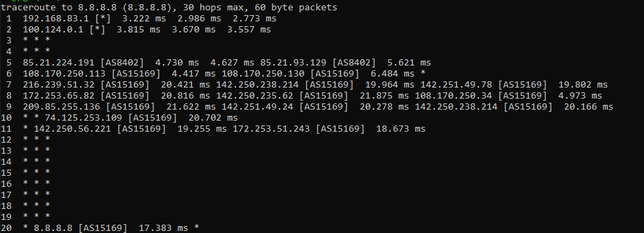
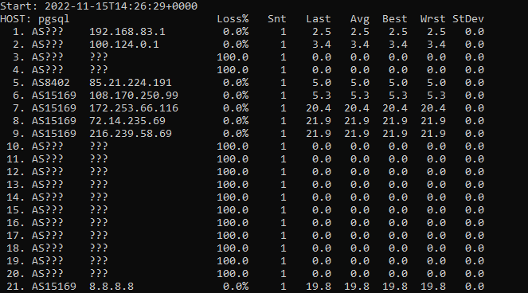
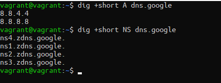
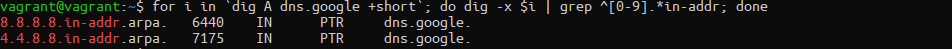

## Задание

1. Работа c HTTP через телнет.
- Подключитесь утилитой телнет к сайту stackoverflow.com
`telnet stackoverflow.com 80`
- Отправьте HTTP запрос
```bash
GET /questions HTTP/1.0
HOST: stackoverflow.com
[press enter]
[press enter]
```
*В ответе укажите полученный HTTP код, что он означает?*
```bash
vagrant@vagrant:~$ telnet bibika.ru 80
Trying 87.249.32.214...
Connected to bibika.ru.
Escape character is '^]'.
GET /dealers HTTP/1.0
HOST: bibika.ru

HTTP/1.1 301 Moved Permanently
Server: nginx
Date: Tue, 15 Nov 2022 13:32:34 GMT
Content-Type: text/html
Content-Length: 178
Connection: close
Location: http://www.bibika.ru/dealers

<html>
<head><title>301 Moved Permanently</title></head>
<body bgcolor="white">
<center><h1>301 Moved Permanently</h1></center>
<hr><center>nginx</center>
</body>
</html>
Connection closed by foreign host.
```
*При обращении к stackoverflow.com такой 403 - Forbidden. Доступ к ресурсу заперщен. Сервер принял запрос, но не выполнил его. Видимо заблокировано обращение по порту 80. Поэтому нашел ресурс bibika.ru* </br> *301 Moved Permanently - Постоянное перемещение ресурса. Страницу куда перемещен ресурс можно увидить в заголовке Location*  

2. Повторите задание 1 в браузере, используя консоль разработчика F12.
- откройте вкладку `Network`
- отправьте запрос http://stackoverflow.com
- найдите первый ответ HTTP сервера, откройте вкладку `Headers`
- укажите в ответе полученный HTTP код
- проверьте время загрузки страницы, какой запрос обрабатывался дольше всего?
- приложите скриншот консоли браузера в ответ.
* *Первое открытие*

* *301 Moved Permanently*
* *Время загрузки*

* *Долгий запрос*


3. Какой IP адрес у вас в интернете?
* ```bash
  vagrant@vagrant:~$ curl icanhazip.com
  2.92.126.245
  ```
4. Какому провайдеру принадлежит ваш IP адрес? Какой автономной системе AS? Воспользуйтесь утилитой `whois`
   ```bash
   vagrant@vagrant:~$ whois 2.92.126.245 | grep ^role &&  whois 2.92.126.245 | grep ^origin
   role:           CORBINA TELECOM Network Operations
   origin:         AS3216
   origin:         AS8402
   ```
5. Через какие сети проходит пакет, отправленный с вашего компьютера на адрес 8.8.8.8? Через какие AS? Воспользуйтесь утилитой `traceroute`

6. Повторите задание 5 в утилите `mtr`. На каком участке наибольшая задержка - delay?
 </br> *Большая задержка на 8 и 9 хопах*
7. Какие DNS сервера отвечают за доменное имя dns.google? Какие A записи? Воспользуйтесь утилитой `dig`

8. Проверьте PTR записи для IP адресов из задания 7. Какое доменное имя привязано к IP? Воспользуйтесь утилитой `dig`

*В качестве ответов на вопросы приложите лог выполнения команд в консоли или скриншот полученных результатов.*