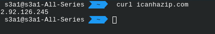
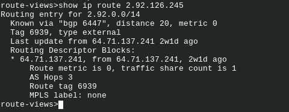

# Домашнее задание к занятию "3.8. Компьютерные сети, лекция 3"

### Цель задания

В результате выполнения этого задания вы:

1. На практике познакомитесь с маршрутизацией в сетях, что позволит понять устройство больших корпоративных сетей и интернета.
2. Проверите TCP/UDP соединения на хосте (это обычный этап отладки сетевых проблем).
3. Построите сетевую диаграмму.

### Чеклист готовности к домашнему заданию

1. Убедитесь, что у вас установлен `telnet`.
2. Воспользуйтесь пакетным менеджером apt для установки.


### Инструкция к заданию

1. Создайте .md-файл для ответов на задания в своём репозитории, после выполнения прикрепите ссылку на него в личном кабинете.
2. Любые вопросы по выполнению заданий спрашивайте в чате учебной группы и/или в разделе “Вопросы по заданию” в личном кабинете.


### Инструменты/ дополнительные материалы, которые пригодятся для выполнения задания

1. [Зачем нужны dummy интерфейсы](https://tldp.org/LDP/nag/node72.html)

------

## Задание

1. Подключитесь к публичному маршрутизатору в интернет. Найдите маршрут к вашему публичному IP
```
telnet route-views.routeviews.org
Username: rviews
show ip route x.x.x.x/32
show bgp x.x.x.x/32
```
 
* show ip route 
 
* show bgp
  <details>

  ```bash
    route-views>show bgp 2.92.126.245
  BGP routing table entry for 2.92.0.0/14, version 2541770293
  Paths: (23 available, best #18, table default)
    Not advertised to any peer
    Refresh Epoch 1
    3267 3216 8402
      194.85.40.15 from 194.85.40.15 (185.141.126.1)
        Origin IGP, metric 0, localpref 100, valid, external
        path 7FE03BB7BDE8 RPKI State not found
        rx pathid: 0, tx pathid: 0
    Refresh Epoch 1
    701 1273 8402 8402 8402 8402 8402 8402
      137.39.3.55 from 137.39.3.55 (137.39.3.55)
        Origin IGP, localpref 100, valid, external
        path 7FE146771CD0 RPKI State not found
        rx pathid: 0, tx pathid: 0
    Refresh Epoch 1
    3303 6762 8402
      217.192.89.50 from 217.192.89.50 (138.187.128.158)
        Origin IGP, localpref 100, valid, external
        Community: 3303:1004 3303:1006 3303:3052 6762:1 6762:92 6762:14900
        path 7FE0DB558430 RPKI State not found
        rx pathid: 0, tx pathid: 0
    Refresh Epoch 1
    7018 6762 8402
      12.0.1.63 from 12.0.1.63 (12.0.1.63)
        Origin IGP, localpref 100, valid, external
        Community: 7018:5000 7018:37232
        path 7FE1131251F8 RPKI State not found
        rx pathid: 0, tx pathid: 0
    Refresh Epoch 1
    8283 6762 8402
      94.142.247.3 from 94.142.247.3 (94.142.247.3)
        Origin IGP, metric 0, localpref 100, valid, external
        Community: 6762:1 6762:92 6762:14900 8283:1 8283:101
        unknown transitive attribute: flag 0xE0 type 0x20 length 0x24
          value 0000 205B 0000 0000 0000 0001 0000 205B
                0000 0005 0000 0001 0000 205B 0000 0008
                0000 001A 
        path 7FE039560510 RPKI State not found
        rx pathid: 0, tx pathid: 0
    Refresh Epoch 1
    57866 6830 6762 8402
      37.139.139.17 from 37.139.139.17 (37.139.139.17)
        Origin IGP, metric 0, localpref 100, valid, external
        Community: 6762:1 6762:92 6762:14900 6830:17000 6830:17413 6830:23001 6830:33104 57866:100 65100:6830 65103:2 65104:31
        unknown transitive attribute: flag 0xE0 type 0x20 length 0x30
          value 0000 E20A 0000 0064 0000 1AAE 0000 E20A
                0000 0065 0000 0064 0000 E20A 0000 0067
                0000 0002 0000 E20A 0000 0068 0000 001F
                
        path 7FE0A8200DE8 RPKI State not found
        rx pathid: 0, tx pathid: 0
    Refresh Epoch 1
    3333 6762 8402
      193.0.0.56 from 193.0.0.56 (193.0.0.56)
        Origin IGP, localpref 100, valid, external
        Community: 6762:1 6762:92 6762:14900
        path 7FE1085191E8 RPKI State not found
        rx pathid: 0, tx pathid: 0
    Refresh Epoch 1
    20912 3257 3356 8402 8402 8402
      212.66.96.126 from 212.66.96.126 (212.66.96.126)
        Origin IGP, localpref 100, valid, external
        Community: 3257:8070 3257:30515 3257:50001 3257:53900 3257:53902 20912:65004
        path 7FE17D4FE9C8 RPKI State not found
        rx pathid: 0, tx pathid: 0
    Refresh Epoch 1
    3356 8402 8402 8402
      4.68.4.46 from 4.68.4.46 (4.69.184.201)
        Origin IGP, metric 0, localpref 100, valid, external
        Community: 3356:2 3356:22 3356:100 3356:123 3356:501 3356:903 3356:2065 8402:900 8402:904
        path 7FE124AE2E60 RPKI State not found
        rx pathid: 0, tx pathid: 0
    Refresh Epoch 1
    3549 3356 8402 8402 8402
      208.51.134.254 from 208.51.134.254 (67.16.168.191)
        Origin IGP, metric 0, localpref 100, valid, external
        Community: 3356:2 3356:22 3356:100 3356:123 3356:501 3356:903 3356:2065 3549:2581 3549:30840 8402:900 8402:904
        path 7FE041F6A6C8 RPKI State not found
        rx pathid: 0, tx pathid: 0
    Refresh Epoch 1
    3561 3910 3356 8402 8402 8402
      206.24.210.80 from 206.24.210.80 (206.24.210.80)
        Origin IGP, localpref 100, valid, external
        path 7FE0B8C26728 RPKI State not found
        rx pathid: 0, tx pathid: 0
    Refresh Epoch 1
    19214 174 6762 8402
      208.74.64.40 from 208.74.64.40 (208.74.64.40)
        Origin IGP, localpref 100, valid, external
        Community: 174:21000 174:22013
        path 7FE155C897E8 RPKI State not found
        rx pathid: 0, tx pathid: 0
    Refresh Epoch 2
    2497 3356 8402 8402 8402
      202.232.0.2 from 202.232.0.2 (58.138.96.254)
        Origin IGP, localpref 100, valid, external
        path 7FE0B1EE22D0 RPKI State not found
        rx pathid: 0, tx pathid: 0
    Refresh Epoch 1
    101 174 6762 8402
      209.124.176.223 from 209.124.176.223 (209.124.176.223)
        Origin IGP, localpref 100, valid, external
        Community: 101:20100 101:20110 101:22100 174:21000 174:22013
        Extended Community: RT:101:22100
        path 7FE162B292D0 RPKI State not found
        rx pathid: 0, tx pathid: 0
    Refresh Epoch 1
    7660 2516 6762 8402
      203.181.248.168 from 203.181.248.168 (203.181.248.168)
        Origin IGP, localpref 100, valid, external
        Community: 2516:1030 7660:9003
        path 7FE02E9B9E88 RPKI State not found
        rx pathid: 0, tx pathid: 0
    Refresh Epoch 1
    4901 6079 3356 8402 8402 8402
      162.250.137.254 from 162.250.137.254 (162.250.137.254)
        Origin IGP, localpref 100, valid, external
        Community: 65000:10100 65000:10300 65000:10400
        path 7FE16E42FC08 RPKI State not found
        rx pathid: 0, tx pathid: 0
    Refresh Epoch 1
    20130 6939 6762 8402
      140.192.8.16 from 140.192.8.16 (140.192.8.16)
        Origin IGP, localpref 100, valid, external
        path 7FE0A4D53D78 RPKI State not found
        rx pathid: 0, tx pathid: 0
    Refresh Epoch 1
    6939 6762 8402
      64.71.137.241 from 64.71.137.241 (216.218.252.164)
        Origin IGP, localpref 100, valid, external, best
        path 7FE0F4D37D78 RPKI State not found
        rx pathid: 0, tx pathid: 0x0
    Refresh Epoch 1
    53767 14315 6453 6762 8402
      162.251.163.2 from 162.251.163.2 (162.251.162.3)
        Origin IGP, localpref 100, valid, external
        Community: 14315:5000 53767:5000
        path 7FE035298390 RPKI State not found
        rx pathid: 0, tx pathid: 0
    Refresh Epoch 1
    852 2914 6762 8402
      154.11.12.212 from 154.11.12.212 (96.1.209.43)
        Origin IGP, metric 0, localpref 100, valid, external
        path 7FE0D3EB4A70 RPKI State not found
        rx pathid: 0, tx pathid: 0
    Refresh Epoch 1
    49788 12552 3216 8402
      91.218.184.60 from 91.218.184.60 (91.218.184.60)
        Origin IGP, localpref 100, valid, external
        Community: 12552:12000 12552:12100 12552:12101 12552:22000
        Extended Community: 0x43:100:1
        path 7FE1728BE068 RPKI State not found
        rx pathid: 0, tx pathid: 0
    Refresh Epoch 1
    1351 6939 3216 8402
      132.198.255.253 from 132.198.255.253 (132.198.255.253)
        Origin IGP, localpref 100, valid, external
        path 7FE034073C78 RPKI State not found
        rx pathid: 0, tx pathid: 0
    Refresh Epoch 1
    3257 3356 8402 8402 8402
      89.149.178.10 from 89.149.178.10 (213.200.83.26)
        Origin IGP, metric 10, localpref 100, valid, external
        Community: 3257:8794 3257:30043 3257:50001 3257:54900 3257:54901
        path 7FE1339A15B8 RPKI State not found
        rx pathid: 0, tx pathid: 0
  
  ```
 
2. Создайте dummy0 интерфейс в Ubuntu. Добавьте несколько статических маршрутов. Проверьте таблицу маршрутизации.
```bash
vagrant@vagrant:~$ sudo modprobe -v dummy numdummies=1
insmod /lib/modules/5.4.0-110-generic/kernel/drivers/net/dummy.ko numdummies=0 numdummies=1
vagrant@vagrant:~$ ip a sh dummy0
3: dummy0: <BROADCAST,NOARP> mtu 1500 qdisc noop state DOWN group default qlen 1000
    link/ether c6:0f:50:93:f3:58 brd ff:ff:ff:ff:ff:ff
agrant@vagrant:~$ sudo ip route add 10.1.4.12 via 192.168.83.1
vagrant@vagrant:~$ sudo ip route add 10.1.10.0/29 via 192.168.83.1
vagrant@vagrant:~$ ip r
default via 10.0.2.2 dev eth0 proto dhcp src 10.0.2.15 metric 100 
default via 192.168.83.1 dev eth1 proto dhcp src 192.168.83.27 metric 100 
10.0.2.0/24 dev eth0 proto kernel scope link src 10.0.2.15 
10.0.2.2 dev eth0 proto dhcp scope link src 10.0.2.15 metric 100 
10.1.4.12 via 192.168.83.1 dev eth1 
10.1.10.0/29 via 192.168.83.1 dev eth1 
192.168.83.0/24 dev eth1 proto kernel scope link src 192.168.83.27 
192.ip a sh dummy0168.83.1 dev eth1 proto dhcp scope link src 192.168.83.27 metric 100 
vagrant@vagrant:~$ 

```

3. Проверьте открытые TCP порты в Ubuntu, какие протоколы и приложения используют эти порты? Приведите несколько примеров.


4. Проверьте используемые UDP сокеты в Ubuntu, какие протоколы и приложения используют эти порты?

5. Используя diagrams.net, создайте L3 диаграмму вашей домашней сети или любой другой сети, с которой вы работали. 


*В качестве решения ответьте на вопросы, опишите, каким образом эти ответы были получены и приложите по неоходимости скриншоты*

 ---

## Задание для самостоятельной отработки* (необязательно к выполнению)

6. Установите Nginx, настройте в режиме балансировщика TCP или UDP.

7. Установите bird2, настройте динамический протокол маршрутизации RIP.

8. Установите Netbox, создайте несколько IP префиксов, используя curl проверьте работу API.

----