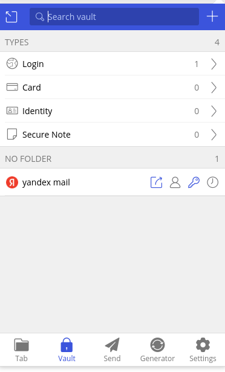
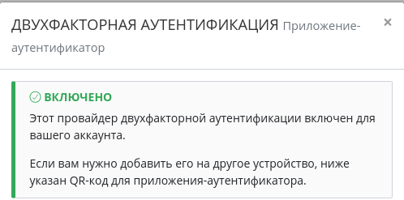
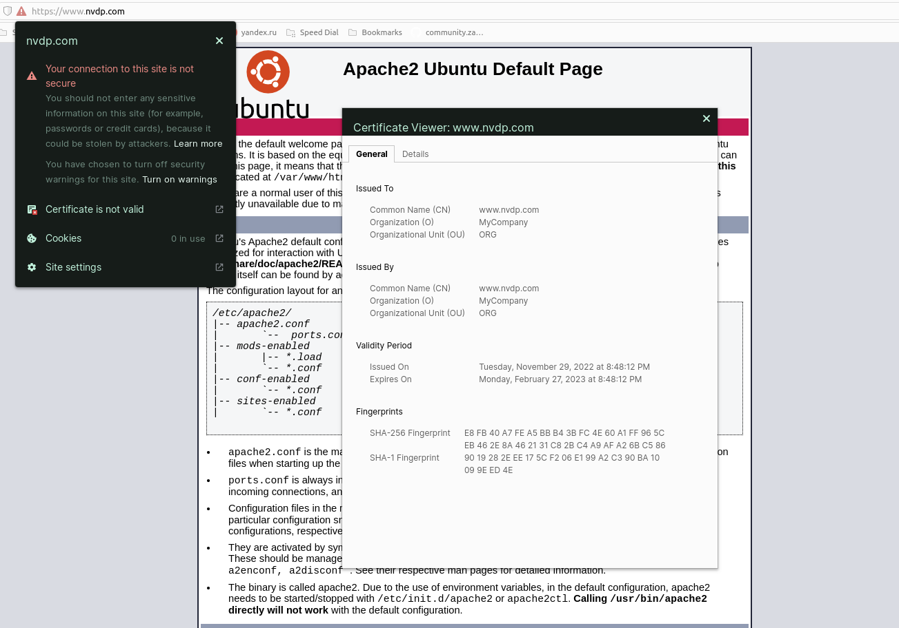
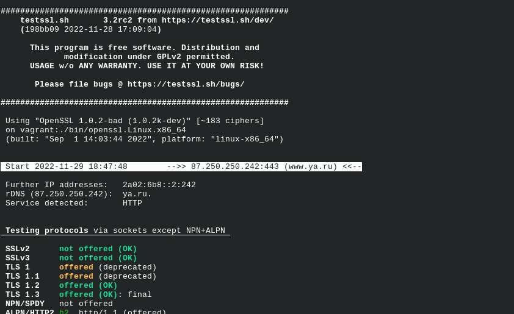
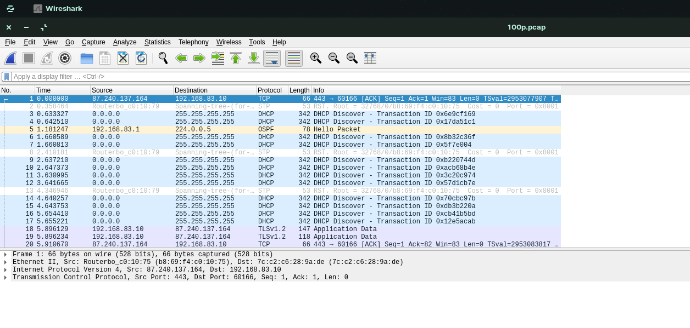

# Домашнее задание к занятию "3.9. Элементы безопасности информационных систем"


### Цель задания

В результате выполнения этого задания вы: 

1. Настроите парольный менеджер, что позволит не использовать один и тот же пароль на все ресурсы и удобно работать с множеством паролей.
2. Настроите веб-сервер на работу с https. Сегодня https является стандартом в интернете. Понимание сути работы центра сертификации, цепочки сертификатов позволит понять, на чем основывается https протокол.
3. Сконфигурируете ssh клиент на работу с разными серверами по-разному, что дает большую гибкость ssh соединений. Например, к некоторым серверам мы можем обращаться по ssh через приложения, где недоступен ввод пароля.
4. Поработаете со сбором и анализом трафика, которые необходимы для отладки сетевых проблем


### Инструкция к заданию

1. Создайте .md-файл для ответов на задания в своём репозитории, после выполнения прикрепите ссылку на него в личном кабинете.
2. Любые вопросы по выполнению заданий спрашивайте в чате учебной группы и/или в разделе “Вопросы по заданию” в личном кабинете.


### Инструменты/ дополнительные материалы, которые пригодятся для выполнения задания

1. [SSL + Apache2](https://digitalocean.com/community/tutorials/how-to-create-a-self-signed-ssl-certificate-for-apache-in-ubuntu-20-04)

------

## Задание

1. Установите Bitwarden плагин для браузера. Зарегестрируйтесь и сохраните несколько паролей.
   

2. Установите Google authenticator на мобильный телефон. Настройте вход в Bitwarden акаунт через Google authenticator OTP.

   

3. Установите apache2, сгенерируйте самоподписанный сертификат, настройте тестовый сайт для работы по HTTPS.
   ```bash
   vagrant@vagrant:~$ sudo apt update
   vagrant@vagrant:~$ sudo apt upgrade -y
   vagrant@vagrant:~$ sudo apt install apache2 -y
   vagrant@vagrant:~$ sudo openssl req -x509 -nodes -days 90 -newkey rsa:2048 \ 
                      -keyout /etc/ssl/private/apache-selfsigned.key -out /etc/ssl/private/apache-selfsigned.crt \ 
                      -subj "/C=RU/ST=Moscow/L=Moscow/O=MyCompany/OU=ORG/CN=www.nowhere.com"ache-selfsigned.key \ 
                      -out /etc/ssl/private/apache-selfsigned.crt -subj "/C=RU/ST=Moscow/L=Moscow/O=MyCompany/OU=ORG/CN=www.nvdp.com"
   vagrant@vagrant:~$ sudo ls -la /etc/ssl/private/
   total 20
   drwx--x--- 2 root ssl-cert 4096 Nov 29 17:48 .
   drwxr-xr-x 4 root root     4096 Nov 29 17:35 ..
   -rw-r--r-- 1 root root     1342 Nov 29 17:48 apache-selfsigned.crt
   -rw------- 1 root root     1708 Nov 29 17:48 apache-selfsigned.key
   vagrant@vagrant:~$ sudo a2enmod ssl
   vagrant@vagrant:~$ sudo a2ensite default-ssl
   Enabling site default-ssl.
   To activate the new configuration, you need to run:
   systemctl reload apache2
   vagrant@vagrant:~$ sudo systemctl reload apache2
   vagrant@vagrant:~$ sudo nano /etc/apache2/sites-enabled/default-ssl.conf
   ```
   Добавил строки
   ```bash
   SSLProtocol all -SSLv2
   SSLCertificateFile    /etc/ssl/private/apache-selfsigned.crt
   SSLCertificateKeyFile /etc/ssl/private/apache-selfsigned.key
   ```
   `sudo systemctl reload apache2` \
   Проверяем:
   

4. Проверьте на TLS уязвимости произвольный сайт в интернете (кроме сайтов МВД, ФСБ, МинОбр, НацБанк, РосКосмос, РосАтом, РосНАНО и любых госкомпаний, объектов КИИ, ВПК ... и тому подобное).
   ```bash
   vagrant@vagrant:~$ git clone --depth 1 https://github.com/drwetter/testssl.sh.git
   Cloning into 'testssl.sh'...
   remote: Enumerating objects: 104, done.
   remote: Counting objects: 100% (104/104), done.
   remote: Compressing objects: 100% (97/97), done.
   remote: Total 104 (delta 15), reused 33 (delta 6), pack-reused 0
   Receiving objects: 100% (104/104), 8.68 MiB | 1.36 MiB/s, done.
   Resolving deltas: 100% (15/15), done.
   vagrant@vagrant:~$ cd testssl.sh
   vagrant@vagrant:~/testssl.sh$ ./testssl.sh https://www.ya.ru/
   
   ```
   
5. Установите на Ubuntu ssh сервер, сгенерируйте новый приватный ключ. Скопируйте свой публичный ключ на другой сервер. Подключитесь к серверу по SSH-ключу.
   ```bash
   vagrant@vm1:~$ ssh-keygen
   Generating public/private rsa key pair.
   Enter file in which to save the key (/home/vagrant/.ssh/id_rsa): 
   Enter passphrase (empty for no passphrase): 
   Enter same passphrase again: 
   Your identification has been saved in /home/vagrant/.ssh/id_rsa
   Your public key has been saved in /home/vagrant/.ssh/id_rsa.pub
   The key fingerprint is:
   SHA256:L5XsyD1ccsRq1KtPzIWlcSOuWqF+CI3VtCFHwbLC0oM vagrant@vm1
   The key's randomart image is:
   +---[RSA 3072]----+
   |         oo.     |
   |        o =o     |
   |     +   B.o* +  |
   |    E = ooo= O . |
   |     . *S O B .  |
   |      o..X X .   |
   |       .=.X +    |
   |       ..+.+     |
   |        o.  .    |
   +----[SHA256]-----+
   vagrant@vm1:~$ ssh-copy-id -i .ssh/id_rsa vagrant@192.168.83.31
   /usr/bin/ssh-copy-id: INFO: Source of key(s) to be installed: ".ssh/id_rsa.pub"
   The authenticity of host '192.168.83.31 (192.168.83.31)' can't be established.
   ECDSA key fingerprint is SHA256:8Lb/tKqeyNQllMhaDRbn8d8aX/ef6T2IkQ5EWnKa01s.
   Are you sure you want to continue connecting (yes/no/[fingerprint])? yes
   /usr/bin/ssh-copy-id: INFO: attempting to log in with the new key(s), to filter out any that are already installed
   /usr/bin/ssh-copy-id: INFO: 1 key(s) remain to be installed -- if you are prompted now it is to install the new keys
   vagrant@192.168.83.31's password: 

   Number of key(s) added: 1

   Now try logging into the machine, with:   "ssh 'vagrant@192.168.83.31'"
   and check to make sure that only the key(s) you wanted were added.

   
   vagrant@vm1:~$ ssh vagrant@192.168.83.31
   Welcome to Ubuntu 20.04.4 LTS (GNU/Linux 5.4.0-110-generic x86_64)

   * Documentation:  https://help.ubuntu.com
   * Management:     https://landscape.canonical.com
   * Support:        https://ubuntu.com/advantage

   System information as of Tue 29 Nov 2022 07:52:34 PM UTC

   System load:  0.76               Processes:             122
   Usage of /:   11.1% of 30.63GB   Users logged in:       0
   Memory usage: 21%                IPv4 address for eth0: 10.0.2.15
   Swap usage:   0%                 IPv4 address for eth1: 192.168.83.31
   This system is built by the Bento project by Chef Software
   More information can be found at https://github.com/chef/bento
   vagrant@vm2:~$ ^C
   vagrant@vm2:~$ 
   ```
6. Переименуйте файлы ключей из задания 5. Настройте файл конфигурации SSH клиента, так чтобы вход на удаленный сервер осуществлялся по имени сервера.
   ```bash
   vagrant@vm1:~$ sudo mv ~/.ssh/id_rsa ~/.ssh/id_rsa_1
   vagrant@vm1:~$ sudo nano ~/.ssh/config
   Host vm2
        HostName 192.168.83.31
        User vagrant
        Port 22
        IdentityFile ~/.ssh/id_rsa_1

   vagrant@vm1:~$ ssh vm2
   Welcome to Ubuntu 20.04.4 LTS (GNU/Linux 5.4.0-110-generic x86_64)

   * Documentation:  https://help.ubuntu.com
   * Management:     https://landscape.canonical.com
   * Support:        https://ubuntu.com/advantage

   System information as of Tue 29 Nov 2022 08:05:33 PM UTC

   System load:  0.08               Processes:             120
   Usage of /:   12.0% of 30.63GB   Users logged in:       0
   Memory usage: 22%                IPv4 address for eth0: 10.0.2.15
   Swap usage:   0%                 IPv4 address for eth1: 192.168.83.31


   This system is built by the Bento project by Chef Software
   More information can be found at https://github.com/chef/bento
   Last login: Tue Nov 29 20:03:35 2022 from 192.168.83.30
   vagrant@vm2:~$ 

   ```
7. Соберите дамп трафика утилитой tcpdump в формате pcap, 100 пакетов. Откройте файл pcap в Wireshark.
   ```bash
   sudo tcpdump -c 100 -w 100p.pcap
   [sudo] password for s3a1:           
   tcpdump: listening on wlx7cc2c6289ade, link-type EN10MB (Ethernet), capture size 262144 bytes
   100 packets captured
   103 packets received by filter
   0 packets dropped by kernel
   5 packets dropped by interface
   ```
   
*В качестве решения приложите: скриншоты, выполняемые команды, комментарии (по необходимости).*

 ---

## Задание для самостоятельной отработки* (необязательно к выполнению)

8. Просканируйте хост scanme.nmap.org. Какие сервисы запущены?
   ```bash
   $ nmap scanme.nmap.org
     Starting Nmap 7.80 ( https://nmap.org ) at 2022-11-29 23:26 MSK
     Nmap scan report for scanme.nmap.org (45.33.32.156)
     Host is up (0.28s latency).
     Other addresses for scanme.nmap.org (not scanned): 2600:3c01::f03c:91ff:fe18:bb2f
     Not shown: 995 closed ports
     PORT      STATE    SERVICE
     22/tcp    open     ssh
     25/tcp    filtered smtp
     80/tcp    open     http
     9929/tcp  open     nping-echo
     31337/tcp open     Elite

     Nmap done: 1 IP address (1 host up) scanned in 16.29 seconds
   ```
   SSH,web,nping и какая-то утилита на порту 31337(извесный как ELEET), и smtp под вопросом

9. Установите и настройте фаервол ufw на web-сервер из задания 3. Откройте доступ снаружи только к портам 22,80,443
   ```bash
   vagrant@vm1:~$ sudo ufw app list
   Available applications:
   Apache
   Apache Full
   Apache Secure
   OpenSSH
   vagrant@vm1:~$ sudo ufw allow OpenSSH
   Rule added
   Rule added (v6)
   vagrant@vm1:~$ sudo ufw allow "Apache Full"
   Rule added
   Rule added (v6)
   vagrant@vm1:~$
   vagrant@vm1:~$ sudo ufw status numbered
   Status: active

     To                         Action      From
     --                         ------      ----
   [ 1] OpenSSH                    ALLOW IN    Anywhere                  
   [ 2] Apache Full                ALLOW IN    Anywhere                  
   [ 3] OpenSSH (v6)               ALLOW IN    Anywhere (v6)             
   [ 4] Apache Full (v6)           ALLOW IN    Anywhere (v6)             

   vagrant@vm1:~$ 

   ```

----

### Правила приема домашнего задания

В личном кабинете отправлена ссылка на .md файл в вашем репозитории.
