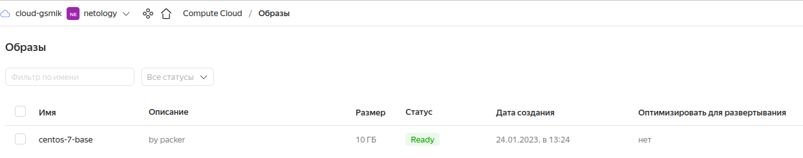
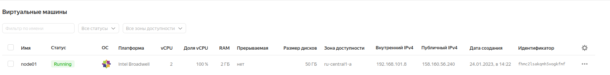

# Домашнее задание к занятию "4. Оркестрация группой Docker контейнеров на примере Docker Compose"

## Как сдавать задания

Обязательными к выполнению являются задачи без указания звездочки. Их выполнение необходимо для получения зачета и диплома о профессиональной переподготовке.

Задачи со звездочкой (*) являются дополнительными задачами и/или задачами повышенной сложности. Они не являются обязательными к выполнению, но помогут вам глубже понять тему.

Домашнее задание выполните в файле readme.md в github репозитории. В личном кабинете отправьте на проверку ссылку на .md-файл в вашем репозитории.

Любые вопросы по решению задач задавайте в чате учебной группы.

---


## Важно!

Перед отправкой работы на проверку удаляйте неиспользуемые ресурсы.
Это важно для того, чтоб предупредить неконтролируемый расход средств, полученных в результате использования промокода.

Подробные рекомендации [здесь](https://github.com/netology-code/virt-homeworks/blob/virt-11/r/README.md)

---

## Задача 1

Создать собственный образ  любой операционной системы (например, centos-7) с помощью Packer ([инструкция](https://cloud.yandex.ru/docs/tutorials/infrastructure-management/packer-quickstart))

Для получения зачета вам необходимо предоставить скриншот страницы с созданным образом из личного кабинета YandexCloud.\
***Ответ:***\
- Скачиваем Yandex Cloude CLI
```shell
$ curl -sSL https://storage.yandexcloud.net/yandexcloud-yc/install.sh | bash
$ yc init
Welcome! This command will take you through the configuration process.
Pick desired action:
 [1] Re-initialize this profile 'default' with new settings 
 [2] Create a new profile
Please enter your numeric choice: 1
Please go to https://oauth.yandex.ru/authorize?response_type=token&client_id=1a********************************b in order to obtain OAuth token.

Please enter OAuth token: [y0_AgAAAAABNTu******************************auS__B9rtUIPDQ] 
You have one cloud available: 'cloud-gsmik' (id = b***************q). It is going to be used by default.
Please choose folder to use:
 [1] default (id = b1gm39s04fv7d27dv38t)
 [2] Create a new folder
Please enter your numeric choice: 1
Your current folder has been set to 'default' (id = b*************t).
Do you want to configure a default Compute zone? [Y/n] 
Which zone do you want to use as a profile default?
 [1] ru-central1-a
 [2] ru-central1-b
 [3] ru-central1-c
 [4] Dont set default zone
Please enter your numeric choice: 1
Your profile default Compute zone has been set to 'ru-central1-a'.

$ yc config list
token: y************************************Q
cloud-id: b*******************q
folder-id: b******************m
compute-default-zone: ru-central1-a

$ yc vpc network create --name net --labels my-label=netology --description "my 1st network"
id: e*************j
folder_id: b*************m
created_at: "2023-01-24T10:01:21Z"
name: net
description: my 1st network
labels:
  my-label: netology

$ yc vpc subnet create --name my-subnet-a --zone ru-central1-a --range 10.1.2.0/24 --network-name net --description "my 1st subnet"       
id: e********************c
folder_id: b**************m
created_at: "2023-01-24T10:06:55Z"
name: my-subnet-a
description: my 1st subnet
network_id: e******************j
zone_id: ru-central1-a
v4_cidr_blocks:
  - 10.1.2.0/24


```
- Скачиваем и устанавливаем Packer
```bash
$ wget https://hashicorp-releases.yandexcloud.net/packer/1.8.5/packer_1.8.5_linux_amd64.zip
$ unzip packer_1.8.5_linux_amd64.zip
$ cp packer /usr/bin
```
- Собираем образ
```shell
$ packer bild centos7-base.json
yandex: output will be in this color.
.....
Build 'yandex' finished after 4 minutes 24 seconds.

$ yc compute image list
+----------------------+---------------+--------+----------------------+--------+
|          ID          |     NAME      | FAMILY |     PRODUCT IDS      | STATUS |
+----------------------+---------------+--------+----------------------+--------+
| fd82j7jqvgprqgoqp583 | centos-7-base | centos | f2ei2tsbd97v7jap5rhc | READY  |
+----------------------+---------------+--------+----------------------+--------+

```



## Задача 2

Создать вашу первую виртуальную машину в YandexCloud.

Для получения зачета, вам необходимо предоставить cкриншот страницы свойств созданной ВМ из личного кабинета YandexCloud.
***Ответ***
- Скачаем и установим terraform
```shell
$ wget https://hashicorp-releases.yandexcloud.net/terraform/1.3.7/terraform_1.3.7_linux_amd64.zip
$ unzip terraform_1.3.7_linux_amd64.zip
$ cp terraform /usr/bin

```
- Установить провайдер
```shell
$ nano ~/.terraformrc
provider_installation {
  network_mirror {
    url = "url провайдера"
    include = ["registry.terraform.io/*/*"]
  }
  direct {
    exclude = ["registry.terraform.io/*/*"]
  }
}
$ 

```
- Создадим service account, сгенирируем key, выдадим права
```shell
$ yc iam service-account create terraform
$ yc iam key create --service-account-name terraform -o key.json
$ yc resource-manager folder add-access-binding netology --role editor --subject serviceAccount:a********i
```
- Создадим vm\
Отредактируем файл variable.tf
```shell
$ terraform init
$ terraform validate
$ terraform plan
$ terraform apply
$ yc compute instance list
+----------------------+--------+---------------+---------+----------------+---------------+
|          ID          |  NAME  |    ZONE ID    | STATUS  |  EXTERNAL IP   |  INTERNAL IP  |
+----------------------+--------+---------------+---------+----------------+---------------+
| fhmc2lsakqmh5vogkfmf | node01 | ru-central1-a | RUNNING | 158.160.56.240 | 192.168.101.8 |
+----------------------+--------+---------------+---------+----------------+---------------+

```


- Удаляем VM

## Задача 3

Создать ваш первый готовый к боевой эксплуатации компонент мониторинга, состоящий из стека микросервисов.

Для получения зачета, вам необходимо предоставить:
- Скриншот работающего веб-интерфейса Grafana с текущими метриками, как на примере ниже
<p align="center">
  
</p>

***Ответ***
- dockerhost dashboard

- monitoring service dashboard

## Задача 4 (*)

Создать вторую ВМ и подключить её к мониторингу развёрнутому на первом сервере.

Для получения зачета, вам необходимо предоставить:
- Скриншот из Grafana, на котором будут отображаться метрики добавленного вами сервера.
