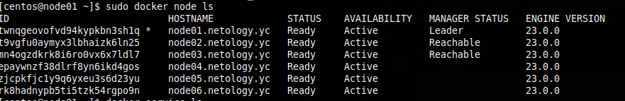
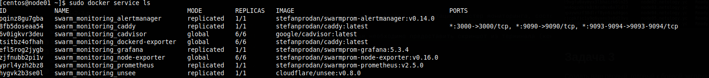
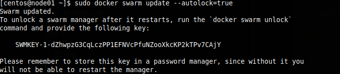

# Домашнее задание к занятию "5. Оркестрация кластером Docker контейнеров на примере Docker Swarm"

## Как сдавать задания

Обязательными к выполнению являются задачи без указания звездочки. Их выполнение необходимо для получения зачета и диплома о профессиональной переподготовке.

Задачи со звездочкой (*) являются дополнительными задачами и/или задачами повышенной сложности. Они не являются обязательными к выполнению, но помогут вам глубже понять тему.

Домашнее задание выполните в файле readme.md в github репозитории. В личном кабинете отправьте на проверку ссылку на .md-файл в вашем репозитории.

Любые вопросы по решению задач задавайте в чате учебной группы.

---


## Важно!

1. Перед отправкой работы на проверку удаляйте неиспользуемые ресурсы.
Это важно для того, чтоб предупредить неконтролируемый расход средств, полученных в результате использования промокода.
Подробные рекомендации [здесь](https://github.com/netology-code/virt-homeworks/blob/virt-11/r/README.md).

2. [Ссылки для установки открытого ПО](https://github.com/netology-code/devops-materials/blob/master/README.md)

---

## Задача 1

Дайте письменые ответы на следующие вопросы:

- В чём отличие режимов работы сервисов в Docker Swarm кластере: replication и global?
- Какой алгоритм выбора лидера используется в Docker Swarm кластере?
- Что такое Overlay Network?\
*Ответ*: 
- В чём отличие режимов работы сервисов в Docker Swarm кластере: replication и global?
   `Global` - запускает одну задачу на каждой ноде. Предварительно заданного количества задач нет. \
   `Replicated` - запускает указанное количество идентичных задач (реплик).
- Какой алгоритм выбора лидера используется в Docker Swarm кластере?
  - Используется алгоритм `Raft` 
  - Если долго нет ответа от лидера, то нода переходит в состояние кандидата, о чем сообщает остальным нодам.
  - Выборы происходят по принципу - кто был первым, большинством голосов. Если приходит ответ и от лидера, то все обнуляется до следующего инцидента.
  - https://docs.docker.com/engine/swarm/raft/
  - http://thesecretlivesofdata.com/raft/
- Что такое Overlay Network?
  - в понятиях Docker - L3 распределённая логическая сеть между несколькими узлами docker. Тк используется шифрование, позволяет контейнерам и узлам выполнять безопасный обмен данными.
## Задача 2

Создать ваш первый Docker Swarm кластер в Яндекс.Облаке

Для получения зачета, вам необходимо предоставить скриншот из терминала (консоли), с выводом команды:
```
docker node ls
```
*Ответ*
```shell
[centos@node01 ~]$ sudo docker node ls
ID                            HOSTNAME             STATUS    AVAILABILITY   MANAGER STATUS   ENGINE VERSION
twnqgeovofvd94kypkbn3sh1q *   node01.netology.yc   Ready     Active         Leader           23.0.0
t9vgfu0aymyx3lbhaizk6ln25     node02.netology.yc   Ready     Active         Reachable        23.0.0
mn4ogzdkrk8i6ro0vx6x7ldl7     node03.netology.yc   Ready     Active         Reachable        23.0.0
epaywnzf38dlrf8yn6ikd4gos     node04.netology.yc   Ready     Active                          23.0.0
zjcpkfjc1y9q6yxeu3s6d23yu     node05.netology.yc   Ready     Active                          23.0.0
rk8hadnypb5ti5tzk54rgpo9n     node06.netology.yc   Ready     Active                          23.0.0
[centos@node01 ~]$ 

```

## Задача 3

Создать ваш первый, готовый к боевой эксплуатации кластер мониторинга, состоящий из стека микросервисов.

Для получения зачета, вам необходимо предоставить скриншот из терминала (консоли), с выводом команды:
```
docker service ls
```
*Ответ*
```shell
[centos@node01 ~]$ sudo docker service ls
ID             NAME                                MODE         REPLICAS   IMAGE                                          PORTS
pqinz8gu7gba   swarm_monitoring_alertmanager       replicated   1/1        stefanprodan/swarmprom-alertmanager:v0.14.0    
8fb5doseaa54   swarm_monitoring_caddy              replicated   1/1        stefanprodan/caddy:latest                      *:3000->3000/tcp, *:9090->9090/tcp, *:9093-9094->9093-9094/tcp
6v0igkvr3deu   swarm_monitoring_cadvisor           global       6/6        google/cadvisor:latest                         
tsitbz4ofhah   swarm_monitoring_dockerd-exporter   global       6/6        stefanprodan/caddy:latest                      
efl5rog2jygb   swarm_monitoring_grafana            replicated   1/1        stefanprodan/swarmprom-grafana:5.3.4           
zjfnubb2pi1v   swarm_monitoring_node-exporter      global       6/6        stefanprodan/swarmprom-node-exporter:v0.16.0   
yprl4yzh2bz8   swarm_monitoring_prometheus         replicated   1/1        stefanprodan/swarmprom-prometheus:v2.5.0       
hygvk2b3se0l   swarm_monitoring_unsee              replicated   1/1        cloudflare/unsee:v0.8.0                        
[centos@node01 ~]$ 

```

## Задача 4 (*)

Выполнить на лидере Docker Swarm кластера команду (указанную ниже) и дать письменное описание её функционала, что она делает и зачем она нужна:
```
# см.документацию: https://docs.docker.com/engine/swarm/swarm_manager_locking/
docker swarm update --autolock=true
```
*Ответ*\
Данная команда включает автоматическую блокировку узлов manager docker swarm после перезапуска
```shell
[centos@node01 ~]$ sudo docker swarm update --autolock=true
Swarm updated.
To unlock a swarm manager after it restarts, run the `docker swarm unlock`
command and provide the following key:

    SWMKEY-1-dZhwpzG3CqLczPP1EFNVcPfuNZooXkcKP2kTPv7CAjY

Please remember to store this key in a password manager, since without it you
will not be able to restart the manager.
[centos@node01 ~]$ 


```
