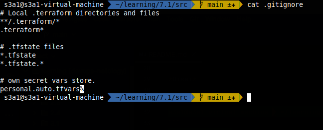

# Домашнее задание к занятию "Введение в Terraform"

### Цель задания

1. Установить и настроить Terrafrom.
2. Научиться использовать готовый код.

------

### Чеклист готовности к домашнему заданию

1. Скачайте и установите актуальную версию **terraform**(не менее 1.3.7). Приложите скриншот вывода команды ```terraform --version```
2. Скачайте на свой ПК данный git репозиторий. Исходный код для выполнения задания расположен в директории **01/src**.
3. Убедитесь, что в вашей ОС установлен docker

------

### Инструменты и дополнительные материалы, которые пригодятся для выполнения задания

1. Установка и настройка Terraform  [ссылка](https://cloud.yandex.ru/docs/tutorials/infrastructure-management/terraform-quickstart#from-yc-mirror)
2. Зеркало документации Terraform  [ссылка](https://registry.tfpla.net/browse/providers) 
3. Установка docker [ссылка](https://docs.docker.com/engine/install/ubuntu/) 
------

### Задание 1

1. Перейдите в каталог [**src**](https://github.com/netology-code/ter-homeworks/tree/main/01/src). Скачайте все необходимые зависимости, использованные в проекте.

    *Ответ*

    ```shell
    s3a1@s3a1-virtual-machine  ~/learning/7.1/src   main ±✚  terraform init
    ```
    

2. Изучите файл **.gitignore**. В каком terraform файле допустимо сохранить личную, секретную информацию?

    *Ответ*

    ```shell
     s3a1@s3a1-virtual-machine  ~/learning/7.1/src   main ±✚  cat .gitignore 
    ```
    

В файле описаны директории и файлы которые не должны попадать в репозиторий проекта\
А нужная нам информации находиться в самом конце файла `personal.auto.vars`
3. Выполните код проекта. Найдите  в State-файле секретное содержимое созданного ресурса **random_password**. Пришлите его в качестве ответа.

    *Ответ*
    ```shell
     s3a1@s3a1-virtual-machine  ~/learning/7.1/src   main ±✚  terraform plan
    ```
    
    ```shell
    s3a1@s3a1-virtual-machine  ~/learning/7.1/src   main ±✚  terraform apply
    ```
   
   ```shell
   s3a1@s3a1-virtual-machine  ~/learning/7.1/src   main ±✚  grep result terraform.tfstate 
   ```
   
4. Раскомментируйте блок кода, примерно расположенный на строчках 29-42 файла **main.tf**.
Выполните команду ```terraform -validate```. Объясните в чем заключаются намеренно допущенные ошибки? Исправьте их.

   *Ответ*
   
    * Отстутствует название для ресурса
    * Некорректное имя ресурса
   
   [Исправленый main,tf](src/main.tf)

5. Выполните код. В качестве ответа приложите вывод команды ```docker ps```
   
   *Ответ*
   
6. Замените имя docker-контейнера в блоке кода на ```hello_world```, выполните команду ```terraform apply -auto-approve```.
Объясните своими словами, в чем может быть опасность применения ключа  ```-auto-approve``` ?

   *Ответ*
   
    ```-auto-approve``` - не контролируемое автоматическое применение исправлений в проекте. Можно похоронить сервисы на некоторе время 
7. Уничтожьте созданные ресурсы с помощью **terraform**. Убедитесь, что все ресурсы удалены. Приложите содержимое файла **terraform.tfstate**.
   ```shell
   sudo terraform destroy
   docker_image.nginx: Refreshing state... [id=sha256:904b8cb13b932e23230836850610fa45dce9eb0650d5618c2b1487c2a4f577b8nginx:latest]
   random_password.random_string: Refreshing state... [id=none]
   docker_container.nginx: Refreshing state... [id=cc701a538de39d0829ca743c59c122b26c5728c5d0c9e291bc4581033083485f]

   Terraform used the selected providers to generate the following execution plan. Resource actions are indicated with the following symbols:
   - destroy
   ....
   Do you really want to destroy all resources?
   Terraform will destroy all your managed infrastructure, as shown above.
   There is no undo. Only 'yes' will be accepted to confirm.

   Enter a value: yes

   docker_container.nginx: Destroying... [id=cc701a538de39d0829ca743c59c122b26c5728c5d0c9e291bc4581033083485f]
   random_password.random_string: Destroying... [id=none]
   random_password.random_string: Destruction complete after 0s
   docker_container.nginx: Destruction complete after 1s
   docker_image.nginx: Destroying... [id=sha256:904b8cb13b932e23230836850610fa45dce9eb0650d5618c2b1487c2a4f577b8nginx:latest]
   docker_image.nginx: Destruction complete after 0s
   
   Destroy complete! Resources: 3 destroyed.

   ```
   
8. Объясните, почему при этом не был удален docker образ **nginx:latest** ?(Ответ найдите в коде проекта или документации)

   *Ответ*
   
   Параметр```keep_locally = true ``` - виновник торжества

------

## Дополнительные задания (со звездочкой*)

**Настоятельно рекомендуем выполнять все задания под звёздочкой.**   Их выполнение поможет глубже разобраться в материале.   
Задания под звёздочкой дополнительные (необязательные к выполнению) и никак не повлияют на получение вами зачета по этому домашнему заданию. 

### Задание 2*

1. Изучите в документации provider [**Virtualbox**](https://registry.tfpla.net/providers/shekeriev/virtualbox/latest/docs/overview/index) от 
shekeriev.
2. Создайте с его помощью любую виртуальную машину.

В качестве ответа приложите plan для создаваемого ресурса.

------

### Правила приема работы

Домашняя работа оформляется в отдельном GitHub репозитории в файле README.md.   
Выполненное домашнее задание пришлите ссылкой на .md-файл в вашем репозитории.

### Критерии оценки

Зачёт:

* выполнены все задания;
* ответы даны в развёрнутой форме;
* приложены соответствующие скриншоты и файлы проекта;
* в выполненных заданиях нет противоречий и нарушения логики.

На доработку:

* задание выполнено частично или не выполнено вообще;
* в логике выполнения заданий есть противоречия и существенные недостатки. 
