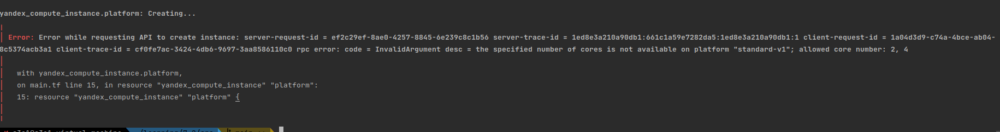

# Домашнее задание к занятию "Основы Terraform. Yandex Cloud"

### Цель задания

1. Создать свои ресурсы в облаке Yandex Cloud с помощью Terraform.
2. Освоить работу с переменными Terraform.


### Чеклист готовности к домашнему заданию

1. Зарегистрирован аккаунт в Yandex Cloud. Использован промокод на грант.
2. Установлен инструмент Yandex Cli.
3. Исходный код для выполнения задания расположен в директории [**02/src**](https://github.com/netology-code/ter-homeworks/tree/main/02/src).


### Задание 0

1. Ознакомьтесь с [документацией к security-groups в Yandex Cloud](https://cloud.yandex.ru/docs/vpc/concepts/security-groups?from=int-console-help-center-or-nav). -готово
2. Запросите preview доступ к данному функционалу в ЛК Yandex Cloud. Обычно его выдают в течении 24-х часов.
https://console.cloud.yandex.ru/folders/<ваш cloud_id>/vpc/security-groups 
Этот функционал понадобится к следующей лекции. - готово


### Задание 1

1. Изучите проект. В файле variables.tf объявлены переменные для yandex provider. - готово
2. Переименуйте файл personal.auto.tfvars_example в personal.auto.tfvars. Заполните переменные (идентификаторы облака, токен доступа). Благодаря .gitignore этот файл не попадет в публичный репозиторий. **Вы можете выбрать иной способ безопасно передать секретные данные в terraform.** - скопировал с нужным именем
3. Сгенерируйте или используйте свой текущий ssh ключ. Запишите его открытую часть в переменную **vms_ssh_root_key**. - готово
4. Инициализируйте проект, выполните код. Исправьте возникшую ошибку. Ответьте в чем заключается ее суть?
5. Ответьте, что означает ```preemptible = true``` и ```core_fraction``` в параметрах ВМ? Как это может пригодится в процессе обучения? Ответ в документации Yandex cloud.

В качестве решения приложите:
- скриншот ЛК Yandex Cloud с созданной ВМ,
- скриншот успешного подключения к консоли ВМ через ssh,
- ответы на вопросы.

*Ответ*
>1. Изучите проект. В файле variables.tf объявлены переменные для yandex provider.\
>
**Прочитал, даже что-то понял**
>2. Переименуйте файл personal.auto.tfvars_example в personal.auto.tfvars. Заполните переменные (идентификаторы облака, токен доступа). Благодаря .gitignore этот файл не попадет в публичный репозиторий. **Вы можете выбрать иной способ безопасно передать секретные данные в terraform.**
>
**Ренейм не мой метод, только копи/паст с нужным именем. всегда держи оригинальный файл рядом. мало ли что**
>3. Сгенерируйте или используйте свой текущий ssh ключ. Запишите его открытую часть в переменную vms_ssh_root_key.
>
**Скопировал свой**
>4. Инициализируйте проект, выполните код. Исправьте возникшую ошибку. Ответьте в чем заключается ее суть?
<details>
    <summary>terraform init/plan/apply</summary>

```shell
s3a1@s3a1-virtual-machine  ~/learning/7.2/src   main ±✚  terraform init

Initializing the backend...

Initializing provider plugins...
- Finding latest version of yandex-cloud/yandex...
- Installing yandex-cloud/yandex v0.88.0...
- Installed yandex-cloud/yandex v0.88.0 (unauthenticated)

Terraform has created a lock file .terraform.lock.hcl to record the provider
selections it made above. Include this file in your version control repository
so that Terraform can guarantee to make the same selections by default when
you run "terraform init" in the future.

╷
│ Warning: Incomplete lock file information for providers
│ 
│ Due to your customized provider installation methods, Terraform was forced to calculate lock file checksums locally for the following providers:
│   - yandex-cloud/yandex
│ 
│ The current .terraform.lock.hcl file only includes checksums for linux_amd64, so Terraform running on another platform will fail to install these providers.
│ 
│ To calculate additional checksums for another platform, run:
│   terraform providers lock -platform=linux_amd64
│ (where linux_amd64 is the platform to generate)
╵

Terraform has been successfully initialized!

You may now begin working with Terraform. Try running "terraform plan" to see
any changes that are required for your infrastructure. All Terraform commands
should now work.

If you ever set or change modules or backend configuration for Terraform,
rerun this command to reinitialize your working directory. If you forget, other
commands will detect it and remind you to do so if necessary.
 s3a1@s3a1-virtual-machine  ~/learning/7.2/src   main ±✚  terraform plan
yandex_vpc_network.develop: Refreshing state... [id=enpa7s4fat4toia3q509]
data.yandex_compute_image.ubuntu: Reading...
data.yandex_compute_image.ubuntu: Read complete after 0s [id=fd8snjpoq85qqv0mk9gi]
yandex_vpc_subnet.develop: Refreshing state... [id=e9b102b7lu5hqbst7tkt]

Terraform used the selected providers to generate the following execution plan. Resource actions are indicated with the following symbols:
  + create

Terraform will perform the following actions:

  # yandex_compute_instance.platform will be created
  + resource "yandex_compute_instance" "platform" {
      + created_at                = (known after apply)
      + folder_id                 = (known after apply)
      + fqdn                      = (known after apply)
      + gpu_cluster_id            = (known after apply)
      + hostname                  = (known after apply)
      + id                        = (known after apply)
      + metadata                  = {
          + "serial-port-enable" = "1"
          + "ssh-keys"           = "ubuntu:ssh-rsa AAAAB3NzaC1yc2EAAAADAQABAAABgQC98WcIWyNYxHuXDcL9/HWvd+Oy570VZx2cBzYL4z9HGLNMwVAxcdPjottkEYEBPa0ew+ZjzpMlDB171/o67R58+X4MPEiJlJeShAillW6EcWs1eb7e8D0sE+jGcuYCk+owyldJYCJOtkFWpMFjZ9MhBkLzwghVa+X03Gq/0pParx5OWElS32MtvhTlTehAdFU5UY6ym1Ueh4CXwfNE3v+PAHcG6f+EDIwZQsdeY5ApMpmP5hDj2y6EQhOoBCXnL0PITaJ+LGwnpAaPB4o4zn/1O/WeUC+cFoSPl83qSrzjMWGCrI/n+TlMMWJxv6nJTtZsIyieQaDkhA6M92lSUK9uKVlCAQjsBiwcP5o84fSsYbj2OT43HscBVmysfcIameIWO6ex7x2s5jsrBCK6ib4aqnXPIUoL8TfdFFoNmVzcLJzG5jJr8nQGQONRniygb7OnhT7A7c6by6Mgu0s/P2F2k+vlFPGgD/tpR+ja2DuLJMruMtxudgpINjdzvBNttrc= s3a1@s3a1-virtual-machine"
        }
      + name                      = "netology-develop-platform-web"
      + network_acceleration_type = "standard"
      + platform_id               = "standard-v1"
      + service_account_id        = (known after apply)
      + status                    = (known after apply)
      + zone                      = (known after apply)

      + boot_disk {
          + auto_delete = true
          + device_name = (known after apply)
          + disk_id     = (known after apply)
          + mode        = (known after apply)

          + initialize_params {
              + block_size  = (known after apply)
              + description = (known after apply)
              + image_id    = "fd8snjpoq85qqv0mk9gi"
              + name        = (known after apply)
              + size        = (known after apply)
              + snapshot_id = (known after apply)
              + type        = "network-hdd"
            }
        }

      + metadata_options {
          + aws_v1_http_endpoint = (known after apply)
          + aws_v1_http_token    = (known after apply)
          + gce_http_endpoint    = (known after apply)
          + gce_http_token       = (known after apply)
        }

      + network_interface {
          + index              = (known after apply)
          + ip_address         = (known after apply)
          + ipv4               = true
          + ipv6               = (known after apply)
          + ipv6_address       = (known after apply)
          + mac_address        = (known after apply)
          + nat                = true
          + nat_ip_address     = (known after apply)
          + nat_ip_version     = (known after apply)
          + security_group_ids = (known after apply)
          + subnet_id          = "e9b102b7lu5hqbst7tkt"
        }

      + placement_policy {
          + host_affinity_rules = (known after apply)
          + placement_group_id  = (known after apply)
        }

      + resources {
          + core_fraction = 5
          + cores         = 1
          + memory        = 1
        }

      + scheduling_policy {
          + preemptible = true
        }
    }

Plan: 1 to add, 0 to change, 0 to destroy.

───────────────────────────────────────────────────────────────────────────────────────────────────────────────────────────────────────────────────────────────────────────────────────────────────────────────────────────────────

Note: You didn't use the -out option to save this plan, so Terraform can't guarantee to take exactly these actions if you run "terraform apply" now.
 s3a1@s3a1-virtual-machine  ~/learning/7.2/src   main ±✚  terraform apply
data.yandex_compute_image.ubuntu: Reading...
yandex_vpc_network.develop: Refreshing state... [id=enpa7s4fat4toia3q509]
yandex_vpc_subnet.develop: Refreshing state... [id=e9b102b7lu5hqbst7tkt]
data.yandex_compute_image.ubuntu: Read complete after 1s [id=fd8snjpoq85qqv0mk9gi]

Terraform used the selected providers to generate the following execution plan. Resource actions are indicated with the following symbols:
  + create

Terraform will perform the following actions:

  # yandex_compute_instance.platform will be created
  + resource "yandex_compute_instance" "platform" {
      + created_at                = (known after apply)
      + folder_id                 = (known after apply)
      + fqdn                      = (known after apply)
      + gpu_cluster_id            = (known after apply)
      + hostname                  = (known after apply)
      + id                        = (known after apply)
      + metadata                  = {
          + "serial-port-enable" = "1"
          + "ssh-keys"           = "ubuntu:ssh-rsa AAAAB3NzaC1yc2EAAAADAQABAAABgQC98WcIWyNYxHuXDcL9/HWvd+Oy570VZx2cBzYL4z9HGLNMwVAxcdPjottkEYEBPa0ew+ZjzpMlDB171/o67R58+X4MPEiJlJeShAillW6EcWs1eb7e8D0sE+jGcuYCk+owyldJYCJOtkFWpMFjZ9MhBkLzwghVa+X03Gq/0pParx5OWElS32MtvhTlTehAdFU5UY6ym1Ueh4CXwfNE3v+PAHcG6f+EDIwZQsdeY5ApMpmP5hDj2y6EQhOoBCXnL0PITaJ+LGwnpAaPB4o4zn/1O/WeUC+cFoSPl83qSrzjMWGCrI/n+TlMMWJxv6nJTtZsIyieQaDkhA6M92lSUK9uKVlCAQjsBiwcP5o84fSsYbj2OT43HscBVmysfcIameIWO6ex7x2s5jsrBCK6ib4aqnXPIUoL8TfdFFoNmVzcLJzG5jJr8nQGQONRniygb7OnhT7A7c6by6Mgu0s/P2F2k+vlFPGgD/tpR+ja2DuLJMruMtxudgpINjdzvBNttrc= s3a1@s3a1-virtual-machine"
        }
      + name                      = "netology-develop-platform-web"
      + network_acceleration_type = "standard"
      + platform_id               = "standard-v1"
      + service_account_id        = (known after apply)
      + status                    = (known after apply)
      + zone                      = (known after apply)

      + boot_disk {
          + auto_delete = true
          + device_name = (known after apply)
          + disk_id     = (known after apply)
          + mode        = (known after apply)

          + initialize_params {
              + block_size  = (known after apply)
              + description = (known after apply)
              + image_id    = "fd8snjpoq85qqv0mk9gi"
              + name        = (known after apply)
              + size        = (known after apply)
              + snapshot_id = (known after apply)
              + type        = "network-hdd"
            }
        }

      + metadata_options {
          + aws_v1_http_endpoint = (known after apply)
          + aws_v1_http_token    = (known after apply)
          + gce_http_endpoint    = (known after apply)
          + gce_http_token       = (known after apply)
        }

      + network_interface {
          + index              = (known after apply)
          + ip_address         = (known after apply)
          + ipv4               = true
          + ipv6               = (known after apply)
          + ipv6_address       = (known after apply)
          + mac_address        = (known after apply)
          + nat                = true
          + nat_ip_address     = (known after apply)
          + nat_ip_version     = (known after apply)
          + security_group_ids = (known after apply)
          + subnet_id          = "e9b102b7lu5hqbst7tkt"
        }

      + placement_policy {
          + host_affinity_rules = (known after apply)
          + placement_group_id  = (known after apply)
        }

      + resources {
          + core_fraction = 5
          + cores         = 1
          + memory        = 1
        }

      + scheduling_policy {
          + preemptible = true
        }
    }

Plan: 1 to add, 0 to change, 0 to destroy.

Do you want to perform these actions?
  Terraform will perform the actions described above.
  Only 'yes' will be accepted to approve.

  Enter a value: yes

yandex_compute_instance.platform: Creating...
╷
│ Error: Error while requesting API to create instance: server-request-id = ef2c29ef-8ae0-4257-8845-6e239c8c1b56 server-trace-id = 1ed8e3a210a90db1:661c1a59e7282da5:1ed8e3a210a90db1:1 client-request-id = 1a04d3d9-c74a-4bce-ab04-8c5374acb3a1 client-trace-id = cf0fe7ac-3424-4db6-9697-3aa8586110c0 rpc error: code = InvalidArgument desc = the specified number of cores is not available on platform "standard-v1"; allowed core number: 2, 4
│ 
│   with yandex_compute_instance.platform,
│   on main.tf line 15, in resource "yandex_compute_instance" "platform":
│   15: resource "yandex_compute_instance" "platform" {
│ 
╵

```
</details>


**В ошибке говориться о не корректно заданном параметре core в создаваемом ресурсе platform.Должно быть 2,4**
<details>
<summary>terraform apply without error</summary>

```shell
 s3a1@s3a1-virtual-machine  ~/learning/7.2/src   main ±✚  terraform apply
data.yandex_compute_image.ubuntu: Reading...
yandex_vpc_network.develop: Refreshing state... [id=enpa7s4fat4toia3q509]
yandex_vpc_subnet.develop: Refreshing state... [id=e9b102b7lu5hqbst7tkt]
data.yandex_compute_image.ubuntu: Read complete after 1s [id=fd8snjpoq85qqv0mk9gi]

Terraform used the selected providers to generate the following execution plan. Resource actions are indicated with the following symbols:
  + create

Terraform will perform the following actions:

  # yandex_compute_instance.platform will be created
  + resource "yandex_compute_instance" "platform" {
      + created_at                = (known after apply)
      + folder_id                 = (known after apply)
      + fqdn                      = (known after apply)
      + gpu_cluster_id            = (known after apply)
      + hostname                  = (known after apply)
      + id                        = (known after apply)
      + metadata                  = {
          + "serial-port-enable" = "1"
          + "ssh-keys"           = "ubuntu:ssh-rsa AAAAB3NzaC1yc2EAAAADAQABAAABgQC98WcIWyNYxHuXDcL9/HWvd+Oy570VZx2cBzYL4z9HGLNMwVAxcdPjottkEYEBPa0ew+ZjzpMlDB171/o67R58+X4MPEiJlJeShAillW6EcWs1eb7e8D0sE+jGcuYCk+owyldJYCJOtkFWpMFjZ9MhBkLzwghVa+X03Gq/0pParx5OWElS32MtvhTlTehAdFU5UY6ym1Ueh4CXwfNE3v+PAHcG6f+EDIwZQsdeY5ApMpmP5hDj2y6EQhOoBCXnL0PITaJ+LGwnpAaPB4o4zn/1O/WeUC+cFoSPl83qSrzjMWGCrI/n+TlMMWJxv6nJTtZsIyieQaDkhA6M92lSUK9uKVlCAQjsBiwcP5o84fSsYbj2OT43HscBVmysfcIameIWO6ex7x2s5jsrBCK6ib4aqnXPIUoL8TfdFFoNmVzcLJzG5jJr8nQGQONRniygb7OnhT7A7c6by6Mgu0s/P2F2k+vlFPGgD/tpR+ja2DuLJMruMtxudgpINjdzvBNttrc= s3a1@s3a1-virtual-machine"
        }
      + name                      = "netology-develop-platform-web"
      + network_acceleration_type = "standard"
      + platform_id               = "standard-v1"
      + service_account_id        = (known after apply)
      + status                    = (known after apply)
      + zone                      = (known after apply)

      + boot_disk {
          + auto_delete = true
          + device_name = (known after apply)
          + disk_id     = (known after apply)
          + mode        = (known after apply)

          + initialize_params {
              + block_size  = (known after apply)
              + description = (known after apply)
              + image_id    = "fd8snjpoq85qqv0mk9gi"
              + name        = (known after apply)
              + size        = (known after apply)
              + snapshot_id = (known after apply)
              + type        = "network-hdd"
            }
        }

      + metadata_options {
          + aws_v1_http_endpoint = (known after apply)
          + aws_v1_http_token    = (known after apply)
          + gce_http_endpoint    = (known after apply)
          + gce_http_token       = (known after apply)
        }

      + network_interface {
          + index              = (known after apply)
          + ip_address         = (known after apply)
          + ipv4               = true
          + ipv6               = (known after apply)
          + ipv6_address       = (known after apply)
          + mac_address        = (known after apply)
          + nat                = true
          + nat_ip_address     = (known after apply)
          + nat_ip_version     = (known after apply)
          + security_group_ids = (known after apply)
          + subnet_id          = "e9b102b7lu5hqbst7tkt"
        }

      + placement_policy {
          + host_affinity_rules = (known after apply)
          + placement_group_id  = (known after apply)
        }

      + resources {
          + core_fraction = 5
          + cores         = 2
          + memory        = 1
        }

      + scheduling_policy {
          + preemptible = true
        }
    }

Plan: 1 to add, 0 to change, 0 to destroy.

Do you want to perform these actions?
  Terraform will perform the actions described above.
  Only 'yes' will be accepted to approve.

  Enter a value: yes

yandex_compute_instance.platform: Creating...
yandex_compute_instance.platform: Still creating... [10s elapsed]
yandex_compute_instance.platform: Still creating... [20s elapsed]
yandex_compute_instance.platform: Still creating... [30s elapsed]
yandex_compute_instance.platform: Creation complete after 31s [id=fhm8s4bvtvtubdupg6mb]

Apply complete! Resources: 1 added, 0 changed, 0 destroyed.

```
</details>

> 5. Ответьте, что означает ```preemptible = true``` и ```core_fraction``` в параметрах ВМ? Как это может пригодится в процессе обучения? Ответ в документации Yandex cloud
> 
```preemptible = true``` - Преврываемая виртуальная машина. По дефолту `false`. Означает, что VM может быть прервана без побочных эфектов, для выполнения каких-либо других действий\
```core_fraction``` -  Базавый уровень производительности CPU. Определяет долю вычислительного времени физ.ядер гарантируемых vCPU


- скриншот ЛК Yandex Cloud с созданной ВМ,

- скриншот успешного подключения к консоли ВМ через ssh,


### Задание 2

1. Изучите файлы проекта.
2. Замените все "хардкод" **значения** для ресурсов **yandex_compute_image** и **yandex_compute_instance** на **отдельные** переменные. К названиям переменных ВМ добавьте в начало префикс **vm_web_** .  Пример: **vm_web_name**.
3. Объявите нужные переменные в файле variables.tf, обязательно указывайте тип переменной. Заполните их **default** прежними значениями из main.tf. 
4. Проверьте terraform plan (изменений быть не должно). 

**Ответ**
1. Изучите файлы проекта. - готово
2. Замените все "хардкод" **значения** для ресурсов **yandex_compute_image** и **yandex_compute_instance** на **отдельные** переменные. К названиям переменных ВМ добавьте в начало префикс **vm_web_** .  Пример: **vm_web_name**. - готово
3. Объявите нужные переменные в файле variables.tf, обязательно указывайте тип переменной. Заполните их **default** прежними значениями из main.tf. 

<details>
<summary>main.tf</summary>

```terraform
resource "yandex_vpc_network" "develop" {
  name = var.vpc_name
}
resource "yandex_vpc_subnet" "develop" {
  name           = var.vpc_name
  zone           = var.default_zone
  network_id     = yandex_vpc_network.develop.id
  v4_cidr_blocks = var.default_cidr
}


/*data "yandex_compute_image" "ubuntu" {
  family = "ubuntu-2004-lts"
}
resource "yandex_compute_instance" "platform" {
  name        = "netology-develop-platform-web"
  platform_id = "standard-v1"
  resources {
    cores         = 2
    memory        = 1
    core_fraction = 5
  }
  boot_disk {
    initialize_params {
      image_id = data.yandex_compute_image.ubuntu.image_id
    }
  }
  scheduling_policy {
    preemptible = true
  }
  network_interface {
    subnet_id = yandex_vpc_subnet.develop.id
    nat       = true
  }
*/
data "yandex_compute_image" "ubuntu" {
  family = var.vm_web_image
}
resource "yandex_compute_instance" "platform" {
  name        = var.vm_web_instance.name
  platform_id = var.vm_web_instance.platform_id
  resources {
    cores         = var.vm_web_instance.resources.cores
    memory        = var.vm_web_instance.resources.memory
    core_fraction = var.vm_web_instance.resources.core_fraction
  }
  boot_disk {
    initialize_params {
      image_id = data.yandex_compute_image.ubuntu.image_id
    }
  }
  scheduling_policy {
    preemptible = var.vm_web_instance.scheduling_policy.preemptible
  }
  network_interface {
    subnet_id = yandex_vpc_subnet.develop.id
    nat       = var.vm_web_instance.network_interface.nat
  }
  metadata = {
    serial-port-enable = var.vm_web_instance.metadata.serial-port-enable
    ssh-keys           = "${var.vms_ssh_user}:${var.vms_ssh_root_key}"
  }
}
/*}
  metadata = {_
    serial-port-enable = 1
    ssh-keys           = "ubuntu:${var.vms_ssh_root_key}"
  }

}
*/


```
</details>

<details>
<summary>variables.tf</summary>

```terraform
###cloud vars
variable "token" {
  type        = string
  description = "OAuth-token; https://cloud.yandex.ru/docs/iam/concepts/authorization/oauth-token"
}

variable "cloud_id" {
  type        = string
  description = "https://cloud.yandex.ru/docs/resource-manager/operations/cloud/get-id"
}

variable "folder_id" {
  type        = string
  description = "https://cloud.yandex.ru/docs/resource-manager/operations/folder/get-id"
}

variable "default_zone" {
  type        = string
  default     = "ru-central1-a"
  description = "https://cloud.yandex.ru/docs/overview/concepts/geo-scope"
}
variable "default_cidr" {
  type        = list(string)
  default     = ["10.0.1.0/24"]
  description = "https://cloud.yandex.ru/docs/vpc/operations/subnet-create"
}

variable "vpc_name" {
  type        = string
  default     = "develop"
  description = "VPC network & subnet name"
}


###ssh vars

variable "vms_ssh_root_key" {
  type        = string
  default     = "ssh-rsa AAAAB3NzaC1yc2EAAAADAQABAAABgQC98WcIWyNYxHuXDcL9/HWvd+Oy570VZx2cBzYL4z9HGLNMwVAxcdPjottkEYEBPa0ew+ZjzpMlDB171/o67R58+X4MPEiJlJeShAillW6EcWs1eb7e8D0sE+jGcuYCk+owyldJYCJOtkFWpMFjZ9MhBkLzwghVa+X03Gq/0pParx5OWElS32MtvhTlTehAdFU5UY6ym1Ueh4CXwfNE3v+PAHcG6f+EDIwZQsdeY5ApMpmP5hDj2y6EQhOoBCXnL0PITaJ+LGwnpAaPB4o4zn/1O/WeUC+cFoSPl83qSrzjMWGCrI/n+TlMMWJxv6nJTtZsIyieQaDkhA6M92lSUK9uKVlCAQjsBiwcP5o84fSsYbj2OT43HscBVmysfcIameIWO6ex7x2s5jsrBCK6ib4aqnXPIUoL8TfdFFoNmVzcLJzG5jJr8nQGQONRniygb7OnhT7A7c6by6Mgu0s/P2F2k+vlFPGgD/tpR+ja2DuLJMruMtxudgpINjdzvBNttrc= s3a1@s3a1-virtual-machine"
  description = "ssh-keygen -t ed25519"
}
#vm vars task2
variable "vm_web_image" {
  type        = string
  default     = "ubuntu-2004-lts"
  description = "OS image"
}

variable "vm_web_instance" {
  type        = object({
    name              = string,
    platform_id       = string,
    resources         = map(number),
    scheduling_policy = map(bool),
    network_interface = map(bool),
    metadata          = map(number)
  })
  default     = {
    name = "netology-develop-platform-web",
    platform_id = "standard-v1",
    resources = {
      cores         = 2
      memory        = 1
      core_fraction = 5
    },
    scheduling_policy = { preemptible = true },
    network_interface = { nat = true },
    metadata          = { serial-port-enable = 1}
  }
  description = "resource instance variables"
}

variable "vms_ssh_user" {
  type        = string
  default     = "ubuntu"
  description = "Root user for OS"
}
```
</details>

4. Проверьте terraform plan (изменений быть не должно).
   


### Задание 3

1. Создайте в корне проекта файл 'vms_platform.tf' . Перенесите в него все переменные ВМ.
2. Скопируйте блок ресурса и создайте с его помощью вторую ВМ: **"netology-develop-platform-db"** ,  cores  = 2, memory = 2, core_fraction = 20. Объявите ее переменные с префиксом **vm_db_** в том же файле.


3. Примените изменения.


*Ответ*
1. Создайте в корне проекта файл 'vms_platform.tf' . Перенесите в него все переменные ВМ. - готово
2. Скопируйте блок ресурса и создайте с его помощью вторую ВМ: **"netology-develop-platform-db"** ,  cores  = 2, memory = 2, core_fraction = 20. Объявите ее переменные с префиксом **vm_db_** в том же файле.

<details>
<summary>vms_platform.tf</summary>

```terraform

###ssh vars

variable "vms_db_ssh_root_key" {
  type        = string
  default     = "ssh-rsa AAAAB3NzaC1yc2EAAAADAQABAAABgQC98WcIWyNYxHuXDcL9/HWvd+Oy570VZx2cBzYL4z9HGLNMwVAxcdPjottkEYEBPa0ew+ZjzpMlDB171/o67R58+X4MPEiJlJeShAillW6EcWs1eb7e8D0sE+jGcuYCk+owyldJYCJOtkFWpMFjZ9MhBkLzwghVa+X03Gq/0pParx5OWElS32MtvhTlTehAdFU5UY6ym1Ueh4CXwfNE3v+PAHcG6f+EDIwZQsdeY5ApMpmP5hDj2y6EQhOoBCXnL0PITaJ+LGwnpAaPB4o4zn/1O/WeUC+cFoSPl83qSrzjMWGCrI/n+TlMMWJxv6nJTtZsIyieQaDkhA6M92lSUK9uKVlCAQjsBiwcP5o84fSsYbj2OT43HscBVmysfcIameIWO6ex7x2s5jsrBCK6ib4aqnXPIUoL8TfdFFoNmVzcLJzG5jJr8nQGQONRniygb7OnhT7A7c6by6Mgu0s/P2F2k+vlFPGgD/tpR+ja2DuLJMruMtxudgpINjdzvBNttrc= s3a1@s3a1-virtual-machine"
  description = "ssh-keygen -t ed25519"
}
variable "vms_db_ssh_user" {
  type        = string
  default     = "ubuntu"
  description = "Root user for OS"
}
#vm vars task2
variable "vm_db_image" {
  type        = string
  default     = "ubuntu-2004-lts"
  description = "OS image"
}

variable "vm_db_instance" {
  type        = object({
    name              = string,
    platform_id       = string,
    resources         = map(number),
    scheduling_policy = map(bool),
    network_interface = map(bool),
    metadata          = map(number)
  })
  default     = {
    name = "netology-develop-platform-db",
    platform_id = "standard-v1",
    resources = {
      cores         = 2
      memory        = 2
      core_fraction = 5
    },
    scheduling_policy = { preemptible = true },
    network_interface = { nat = true },
    metadata          = { serial-port-enable = 1}
  }
  description = "resource instance variables"
}


```
</details>

3. Примените изменения. (Почему так, потаму что экономный:) удаляю после каждого действия )))

<details>
<summary>terraform apply 4 resurces creating</summary>

```terraform
 s3a1@s3a1-virtual-machine  ~/learning/7.2/src   main ±✚  terraform apply
data.yandex_compute_image.ubuntu_db: Reading...
data.yandex_compute_image.ubuntu: Reading...
data.yandex_compute_image.ubuntu_db: Read complete after 0s [id=fd8snjpoq85qqv0mk9gi]
data.yandex_compute_image.ubuntu: Read complete after 0s [id=fd8snjpoq85qqv0mk9gi]

Terraform used the selected providers to generate the following execution plan. Resource actions are indicated with the following symbols:
  + create

Terraform will perform the following actions:

  # yandex_compute_instance.platform will be created
  + resource "yandex_compute_instance" "platform" {
      + created_at                = (known after apply)
      + folder_id                 = (known after apply)
      + fqdn                      = (known after apply)
      + gpu_cluster_id            = (known after apply)
      + hostname                  = (known after apply)
      + id                        = (known after apply)
      + metadata                  = {
          + "serial-port-enable" = "1"
          + "ssh-keys"           = "ubuntu:ssh-rsa AAAAB3NzaC1yc2EAAAADAQABAAABgQC98WcIWyNYxHuXDcL9/HWvd+Oy570VZx2cBzYL4z9HGLNMwVAxcdPjottkEYEBPa0ew+ZjzpMlDB171/o67R58+X4MPEiJlJeShAillW6EcWs1eb7e8D0sE+jGcuYCk+owyldJYCJOtkFWpMFjZ9MhBkLzwghVa+X03Gq/0pParx5OWElS32MtvhTlTehAdFU5UY6ym1Ueh4CXwfNE3v+PAHcG6f+EDIwZQsdeY5ApMpmP5hDj2y6EQhOoBCXnL0PITaJ+LGwnpAaPB4o4zn/1O/WeUC+cFoSPl83qSrzjMWGCrI/n+TlMMWJxv6nJTtZsIyieQaDkhA6M92lSUK9uKVlCAQjsBiwcP5o84fSsYbj2OT43HscBVmysfcIameIWO6ex7x2s5jsrBCK6ib4aqnXPIUoL8TfdFFoNmVzcLJzG5jJr8nQGQONRniygb7OnhT7A7c6by6Mgu0s/P2F2k+vlFPGgD/tpR+ja2DuLJMruMtxudgpINjdzvBNttrc= s3a1@s3a1-virtual-machine"
        }
      + name                      = "netology-develop-platform-web"
      + network_acceleration_type = "standard"
      + platform_id               = "standard-v1"
      + service_account_id        = (known after apply)
      + status                    = (known after apply)
      + zone                      = (known after apply)

      + boot_disk {
          + auto_delete = true
          + device_name = (known after apply)
          + disk_id     = (known after apply)
          + mode        = (known after apply)

          + initialize_params {
              + block_size  = (known after apply)
              + description = (known after apply)
              + image_id    = "fd8snjpoq85qqv0mk9gi"
              + name        = (known after apply)
              + size        = (known after apply)
              + snapshot_id = (known after apply)
              + type        = "network-hdd"
            }
        }

      + metadata_options {
          + aws_v1_http_endpoint = (known after apply)
          + aws_v1_http_token    = (known after apply)
          + gce_http_endpoint    = (known after apply)
          + gce_http_token       = (known after apply)
        }

      + network_interface {
          + index              = (known after apply)
          + ip_address         = (known after apply)
          + ipv4               = true
          + ipv6               = (known after apply)
          + ipv6_address       = (known after apply)
          + mac_address        = (known after apply)
          + nat                = true
          + nat_ip_address     = (known after apply)
          + nat_ip_version     = (known after apply)
          + security_group_ids = (known after apply)
          + subnet_id          = (known after apply)
        }

      + placement_policy {
          + host_affinity_rules = (known after apply)
          + placement_group_id  = (known after apply)
        }

      + resources {
          + core_fraction = 5
          + cores         = 2
          + memory        = 1
        }

      + scheduling_policy {
          + preemptible = true
        }
    }

  # yandex_compute_instance.platform_db will be created
  + resource "yandex_compute_instance" "platform_db" {
      + created_at                = (known after apply)
      + folder_id                 = (known after apply)
      + fqdn                      = (known after apply)
      + gpu_cluster_id            = (known after apply)
      + hostname                  = (known after apply)
      + id                        = (known after apply)
      + metadata                  = {
          + "serial-port-enable" = "1"
          + "ssh-keys"           = "ubuntu:ssh-rsa AAAAB3NzaC1yc2EAAAADAQABAAABgQC98WcIWyNYxHuXDcL9/HWvd+Oy570VZx2cBzYL4z9HGLNMwVAxcdPjottkEYEBPa0ew+ZjzpMlDB171/o67R58+X4MPEiJlJeShAillW6EcWs1eb7e8D0sE+jGcuYCk+owyldJYCJOtkFWpMFjZ9MhBkLzwghVa+X03Gq/0pParx5OWElS32MtvhTlTehAdFU5UY6ym1Ueh4CXwfNE3v+PAHcG6f+EDIwZQsdeY5ApMpmP5hDj2y6EQhOoBCXnL0PITaJ+LGwnpAaPB4o4zn/1O/WeUC+cFoSPl83qSrzjMWGCrI/n+TlMMWJxv6nJTtZsIyieQaDkhA6M92lSUK9uKVlCAQjsBiwcP5o84fSsYbj2OT43HscBVmysfcIameIWO6ex7x2s5jsrBCK6ib4aqnXPIUoL8TfdFFoNmVzcLJzG5jJr8nQGQONRniygb7OnhT7A7c6by6Mgu0s/P2F2k+vlFPGgD/tpR+ja2DuLJMruMtxudgpINjdzvBNttrc= s3a1@s3a1-virtual-machine"
        }
      + name                      = "netology-develop-platform-db"
      + network_acceleration_type = "standard"
      + platform_id               = "standard-v1"
      + service_account_id        = (known after apply)
      + status                    = (known after apply)
      + zone                      = (known after apply)

      + boot_disk {
          + auto_delete = true
          + device_name = (known after apply)
          + disk_id     = (known after apply)
          + mode        = (known after apply)

          + initialize_params {
              + block_size  = (known after apply)
              + description = (known after apply)
              + image_id    = "fd8snjpoq85qqv0mk9gi"
              + name        = (known after apply)
              + size        = (known after apply)
              + snapshot_id = (known after apply)
              + type        = "network-hdd"
            }
        }

      + metadata_options {
          + aws_v1_http_endpoint = (known after apply)
          + aws_v1_http_token    = (known after apply)
          + gce_http_endpoint    = (known after apply)
          + gce_http_token       = (known after apply)
        }

      + network_interface {
          + index              = (known after apply)
          + ip_address         = (known after apply)
          + ipv4               = true
          + ipv6               = (known after apply)
          + ipv6_address       = (known after apply)
          + mac_address        = (known after apply)
          + nat                = true
          + nat_ip_address     = (known after apply)
          + nat_ip_version     = (known after apply)
          + security_group_ids = (known after apply)
          + subnet_id          = (known after apply)
        }

      + placement_policy {
          + host_affinity_rules = (known after apply)
          + placement_group_id  = (known after apply)
        }

      + resources {
          + core_fraction = 5
          + cores         = 2
          + memory        = 2
        }

      + scheduling_policy {
          + preemptible = true
        }
    }

  # yandex_vpc_network.develop will be created
  + resource "yandex_vpc_network" "develop" {
      + created_at                = (known after apply)
      + default_security_group_id = (known after apply)
      + folder_id                 = (known after apply)
      + id                        = (known after apply)
      + labels                    = (known after apply)
      + name                      = "develop"
      + subnet_ids                = (known after apply)
    }

  # yandex_vpc_subnet.develop will be created
  + resource "yandex_vpc_subnet" "develop" {
      + created_at     = (known after apply)
      + folder_id      = (known after apply)
      + id             = (known after apply)
      + labels         = (known after apply)
      + name           = "develop"
      + network_id     = (known after apply)
      + v4_cidr_blocks = [
          + "10.0.1.0/24",
        ]
      + v6_cidr_blocks = (known after apply)
      + zone           = "ru-central1-a"
    }

Plan: 4 to add, 0 to change, 0 to destroy.

Do you want to perform these actions?
  Terraform will perform the actions described above.
  Only 'yes' will be accepted to approve.

  Enter a value: yes

yandex_vpc_network.develop: Creating...
yandex_vpc_network.develop: Creation complete after 0s [id=enpo8i9hs1lgtp8f36h2]
yandex_vpc_subnet.develop: Creating...
yandex_vpc_subnet.develop: Creation complete after 1s [id=e9bersod165h8hk3h28r]
yandex_compute_instance.platform_db: Creating...
yandex_compute_instance.platform: Creating...
yandex_compute_instance.platform: Still creating... [10s elapsed]
yandex_compute_instance.platform_db: Still creating... [10s elapsed]
yandex_compute_instance.platform_db: Still creating... [20s elapsed]
yandex_compute_instance.platform: Still creating... [20s elapsed]
yandex_compute_instance.platform: Still creating... [30s elapsed]
yandex_compute_instance.platform_db: Still creating... [30s elapsed]
yandex_compute_instance.platform: Creation complete after 32s [id=fhmjls2ejh1mslr9d43d]
yandex_compute_instance.platform_db: Creation complete after 37s [id=fhmi0790gjjbkvdakv2c]

Apply complete! Resources: 4 added, 0 changed, 0 destroyed.

```
</details>

<details>
<summary>Result resurces creating</summary>

```shell
 ✘ s3a1@s3a1-virtual-machine  ~/learning/7.2/src   main ±✚  yc compute  instance list --format text
+----------------------+-------------------------------+---------------+---------+---------------+-------------+
|          ID          |             NAME              |    ZONE ID    | STATUS  |  EXTERNAL IP  | INTERNAL IP |
+----------------------+-------------------------------+---------------+---------+---------------+-------------+
| fhmi0790gjjbkvdakv2c | netology-develop-platform-db  | ru-central1-a | RUNNING | 51.250.68.24  | 10.0.1.31   |
| fhmjls2ejh1mslr9d43d | netology-develop-platform-web | ru-central1-a | RUNNING | 62.84.116.252 | 10.0.1.25   |
+----------------------+-------------------------------+---------------+---------+---------------+-------------+
 
 s3a1@s3a1-virtual-machine  ~/learning/7.2/src   main ±✚  yc compute instance get fhmi0790gjjbkvdakv2c
id: fhmi0790gjjbkvdakv2c
folder_id: b1g5f9lqj5kqgmgtcq7m
created_at: "2023-03-27T16:02:13Z"
name: netology-develop-platform-db
zone_id: ru-central1-a
platform_id: standard-v1
resources:
  memory: "2147483648"
  cores: "2"
  core_fraction: "5"
status: RUNNING
metadata_options:
  gce_http_endpoint: ENABLED
  aws_v1_http_endpoint: ENABLED
  gce_http_token: ENABLED
  aws_v1_http_token: DISABLED
boot_disk:
  mode: READ_WRITE
  device_name: fhmbo4ollm5fuvohapq6
  auto_delete: true
  disk_id: fhmbo4ollm5fuvohapq6
network_interfaces:
  - index: "0"
    mac_address: d0:0d:12:01:d2:08
    subnet_id: e9bersod165h8hk3h28r
    primary_v4_address:
      address: 10.0.1.31
      one_to_one_nat:
        address: 51.250.68.24
        ip_version: IPV4
fqdn: fhmi0790gjjbkvdakv2c.auto.internal
scheduling_policy:
  preemptible: true
network_settings:
  type: STANDARD
placement_policy: {}
d: fhmjls2ejh1mslr9d43d
folder_id: b1g5f9lqj5kqgmgtcq7m
created_at: "2023-03-27T16:02:13Z"
name: netology-develop-platform-web
zone_id: ru-central1-a
platform_id: standard-v1
resources:
  memory: "1073741824"
  cores: "2"
  core_fraction: "5"
status: RUNNING
metadata_options:
  gce_http_endpoint: ENABLED
  aws_v1_http_endpoint: ENABLED
  gce_http_token: ENABLED
  aws_v1_http_token: DISABLED
boot_disk:
  mode: READ_WRITE
  device_name: fhmlmmtkq92m3ci9u96m
  auto_delete: true
  disk_id: fhmlmmtkq92m3ci9u96m
network_interfaces:
  - index: "0"
    mac_address: d0:0d:13:af:04:e9
    subnet_id: e9bersod165h8hk3h28r
    primary_v4_address:
      address: 10.0.1.25
      one_to_one_nat:
        address: 62.84.116.252
        ip_version: IPV4
fqdn: fhmjls2ejh1mslr9d43d.auto.internal
scheduling_policy:
  preemptible: true
network_settings:
  type: STANDARD
placement_policy: {}

 s3a1@s3a1-virtual-machine  ~/learning/7.2/src   main ±✚  yc compute instance get fhmjls2ejh1mslr9d43d
id: fhmjls2ejh1mslr9d43d
folder_id: b1g5f9lqj5kqgmgtcq7m
created_at: "2023-03-27T16:02:13Z"
name: netology-develop-platform-web
zone_id: ru-central1-a
platform_id: standard-v1
resources:
  memory: "1073741824"
  cores: "2"
  core_fraction: "5"
status: RUNNING
metadata_options:
  gce_http_endpoint: ENABLED
  aws_v1_http_endpoint: ENABLED
  gce_http_token: ENABLED
  aws_v1_http_token: DISABLED
boot_disk:
  mode: READ_WRITE
  device_name: fhmlmmtkq92m3ci9u96m
  auto_delete: true
  disk_id: fhmlmmtkq92m3ci9u96m
network_interfaces:
  - index: "0"
    mac_address: d0:0d:13:af:04:e9
    subnet_id: e9bersod165h8hk3h28r
    primary_v4_address:
      address: 10.0.1.25
      one_to_one_nat:
        address: 62.84.116.252
        ip_version: IPV4
fqdn: fhmjls2ejh1mslr9d43d.auto.internal
scheduling_policy:
  preemptible: true
network_settings:
  type: STANDARD
placement_policy: {}


```

### Задание 4

1. Объявите в файле outputs.tf отдельные output, для каждой из ВМ с ее внешним IP адресом.
2. Примените изменения.

В качестве решения приложите вывод значений ip-адресов команды ```terraform output```

*Ответ*

1. Объявите в файле outputs.tf отдельные output, для каждой из ВМ с ее внешним IP адресом.
```terraform
output "web" {
    value = yandex_compute_instance.platform.network_interface[0].nat_ip_address
}
output "db" {
  value = yandex_compute_instance.platform_db.network_interface[0].nat_ip_address
}

```

2. Примените изменения. (Ну тут опять terraform apply с уже измененым файлом outputs.tf)

<details>
<summary>terraform apply result</summary> 

```shell
yandex_vpc_network.develop: Creating...
yandex_vpc_network.develop: Creation complete after 1s [id=enpcf5rgauo4thj010t3]
yandex_vpc_subnet.develop: Creating...
yandex_vpc_subnet.develop: Creation complete after 1s [id=e9bk3pr53t8thd81rb2m]
yandex_compute_instance.platform: Creating...
yandex_compute_instance.platform_db: Creating...
yandex_compute_instance.platform: Still creating... [10s elapsed]
yandex_compute_instance.platform_db: Still creating... [10s elapsed]
yandex_compute_instance.platform: Still creating... [20s elapsed]
yandex_compute_instance.platform_db: Still creating... [20s elapsed]
yandex_compute_instance.platform: Creation complete after 29s [id=fhmseu8jpjv59r4atobd]
yandex_compute_instance.platform_db: Still creating... [30s elapsed]
yandex_compute_instance.platform_db: Creation complete after 33s [id=fhma77oragtl1n4u3m0a]

Apply complete! Resources: 4 added, 0 changed, 0 destroyed.

Outputs:

db = "158.160.34.12"
web = "158.160.50.19"
```
</details>


```terraform

 s3a1@s3a1-virtual-machine  ~/learning/7.2/src   main ±✚  terraform output 
db = "158.160.34.12"
web = "158.160.50.19"
```
### Задание 5

1. В файле locals.tf опишите в **одном** local-блоке имя каждой ВМ, используйте интерполяцию по примеру из лекции.
2. Замените переменные с именами ВМ из файла variables.tf на созданные вами local переменные.
3. Примените изменения.


### Задание 6

1. Вместо использования 3-х переменных  ".._cores",".._memory",".._core_fraction" в блоке  resources {...}, объедените их в переменные типа **map** с именами "vm_web_resources" и "vm_db_resources".
2. Так же поступите с блоком **metadata {serial-port-enable, ssh-keys}**, эта переменная должна быть общая для всех ваших ВМ.
3. Найдите и удалите все более не используемые переменные проекта.
4. Проверьте terraform plan (изменений быть не должно).

------

## Дополнительные задания (со звездочкой*)

**Настоятельно рекомендуем выполнять все задания под звёздочкой.**   Их выполнение поможет глубже разобраться в материале.   
Задания под звёздочкой дополнительные (необязательные к выполнению) и никак не повлияют на получение вами зачета по этому домашнему заданию. 

### Задание 7*

Изучите сожержимое файла console.tf. Откройте terraform console, выполните следующие задания: 

1. Напишите, какой командой можно отобразить **второй** элемент списка test_list?
2. Найдите длину списка test_list с помощью функции length(<имя переменной>).
3. Напишите, какой командой можно отобразить значение ключа admin из map test_map ?
4. Напишите interpolation выражение, результатом которого будет: "John is admin for production server based on OS ubuntu-20-04 with X vcpu, Y ram and Z virtual disks", используйте данные из переменных test_list, test_map, servers и функцию length() для подстановки значений.

В качестве решения предоставьте необходимые команды и их вывод.

------
### Правила приема работы

В git-репозитории, в котором было выполнено задание к занятию "Введение в Terraform", создайте новую ветку terraform-02, закомитьте в эту ветку свой финальный код проекта. Ответы на задания и необходимые скриншоты оформите в md-файле в ветке terraform-02.

В качестве результата прикрепите ссылку на ветку terraform-02 в вашем репозитории.

**ВАЖНО!Удалите все созданные ресурсы**.


### Критерии оценки

Зачёт:

* выполнены все задания;
* ответы даны в развёрнутой форме;
* приложены соответствующие скриншоты и файлы проекта;
* в выполненных заданиях нет противоречий и нарушения логики.

На доработку:

* задание выполнено частично или не выполнено вообще;
* в логике выполнения заданий есть противоречия и существенные недостатки. 
